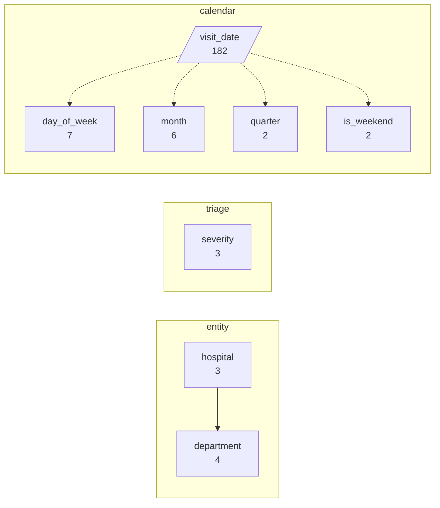
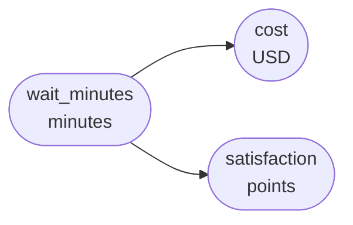
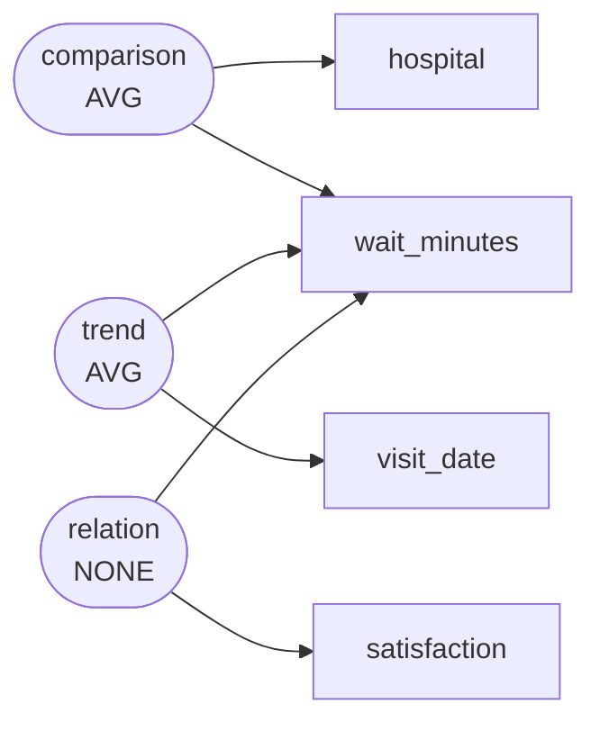

# Emergency department visits and wait times at three metro hospitals, Jan-Jun 2024

The county health department compiled per-visit records from three hospitals for January through June 2024 to assess a new triage diversion policy.

`er_wait` -- 900 rows, 11 columns

## Dimensions

## Numeric columns

## Intents

## What can be drawn

| family | drawable |
|---|---|
| comparison | yes |
| trend | yes |
| composition | yes |
| relation | yes |
| distribution | yes |
| process | no |

Densest two-column cross: hospital x quarter at 150.0 rows per cell.

Gaps:

- No dimension is declared ordered="stage", so no process chart can be drawn. If this scenario has genuine sequential stages, declare that dimension as a stage; if it does not, leave it out rather than inventing one.
