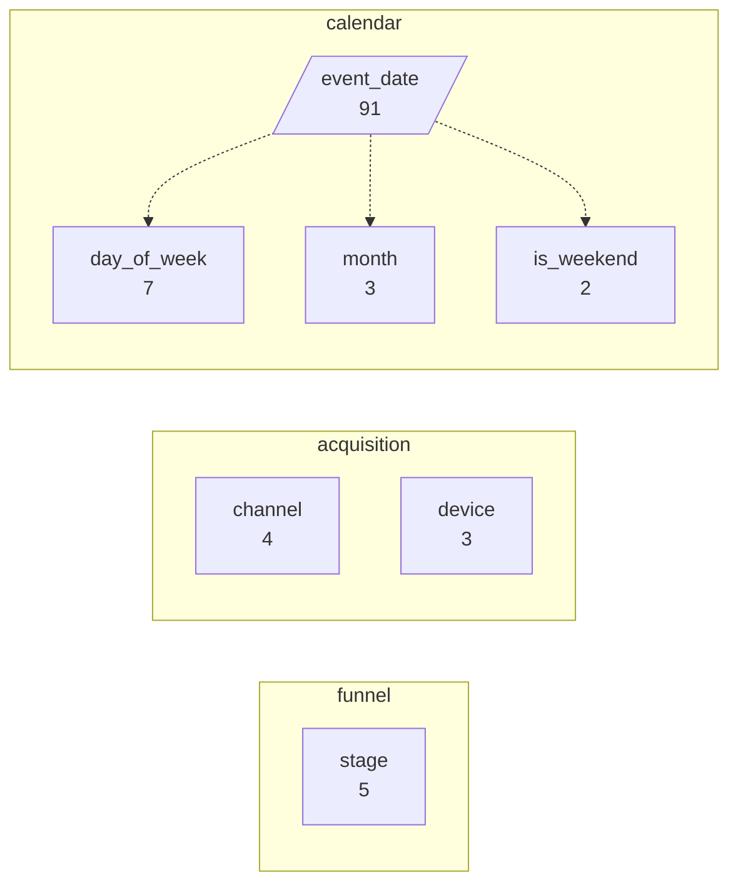
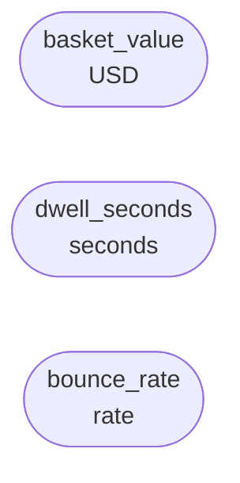
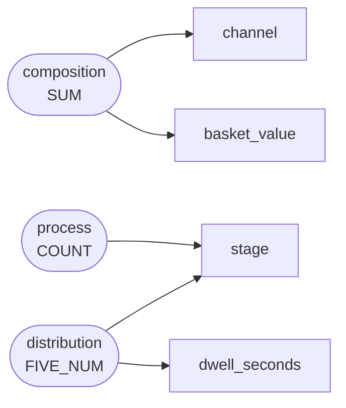

# Online checkout funnel for a regional grocery retailer, Jan-Mar 2024

The e-commerce team logged every session step for the first quarter of 2024 while a redesigned cart page was rolled out, to see where shoppers stop.

`funnel` -- 1400 rows, 10 columns

## Dimensions

## Numeric columns

## Intents

## What can be drawn

| family | drawable |
|---|---|
| comparison | yes |
| trend | yes |
| composition | yes |
| relation | yes |
| distribution | yes |
| process | yes |

Densest two-column cross: device x is_weekend at 233.3 rows per cell.
