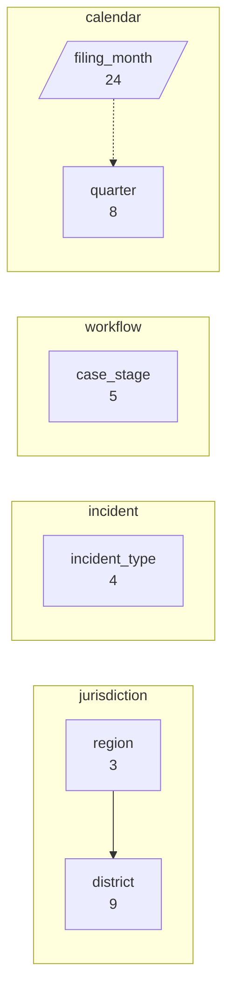
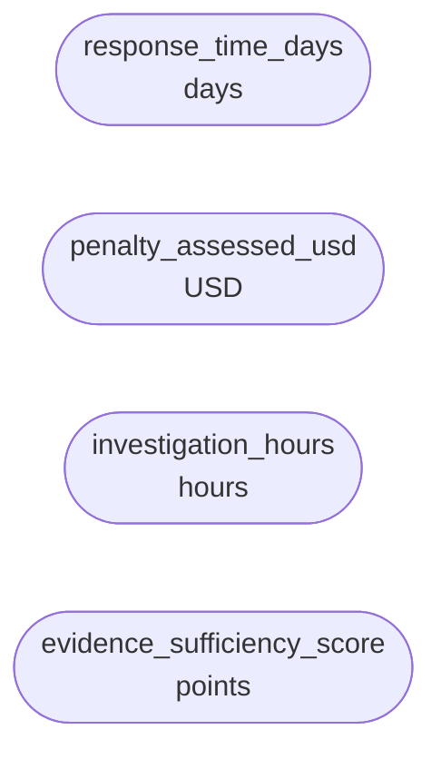
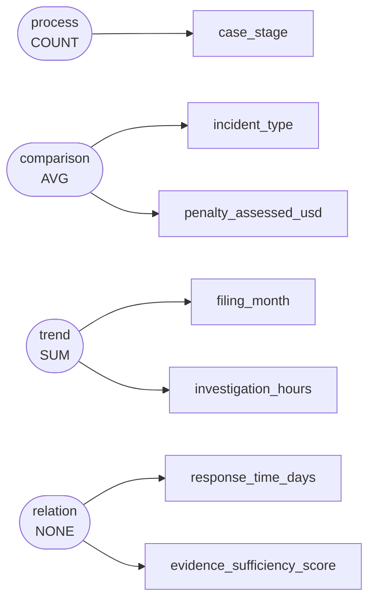

# Protected species incident filings, investigation durations, and penalty assessments across regional enforcement registries, 2023–2024

The National Wildlife Law Enforcement Division maintains an incident and compliance registry logging protected species violations, strandings, and unauthorized habitat disturbances across regional field offices. Field agents and registry intake officers recorded case progression stages, field response times, staff investigation hours, and assessed civil penalties from January 2023 through December 2024 to evaluate enforcement pipeline efficiency and backlog resolution.

`s000` -- 360 rows, 10 columns

Drawn from `dom_0451` Illegal-take case backlog and closure counts -- climate and environment: protected species incident filings logged by field offices — strandings, illegal-take cases and habitat-disturbance reports — with case volumes, response times and enforcement outcomes by district and month (climate and environment / registry), simple

## Dimensions

## Numeric columns

## Intents

## What can be drawn

| family | drawable |
|---|---|
| comparison | yes |
| trend | yes |
| composition | yes |
| relation | yes |
| distribution | yes |
| process | yes |

Densest two-column cross: region x incident_type at 30.0 rows per cell.
