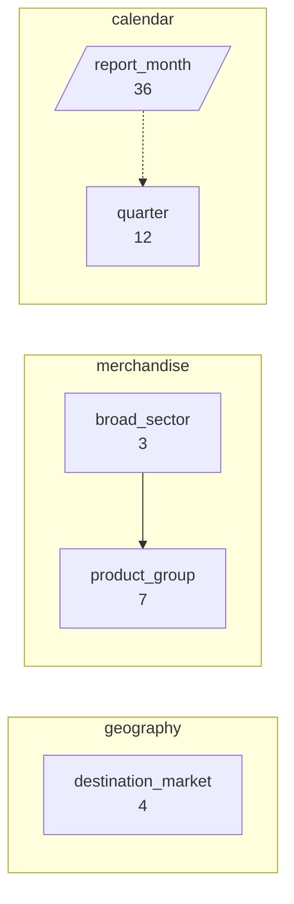
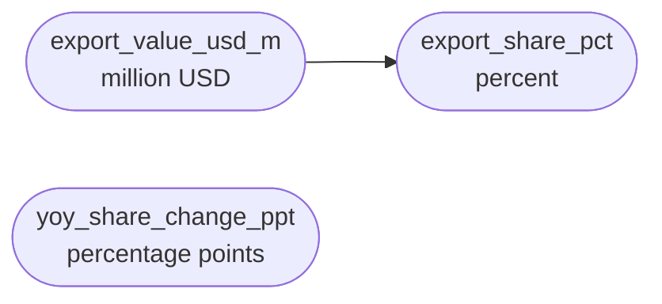
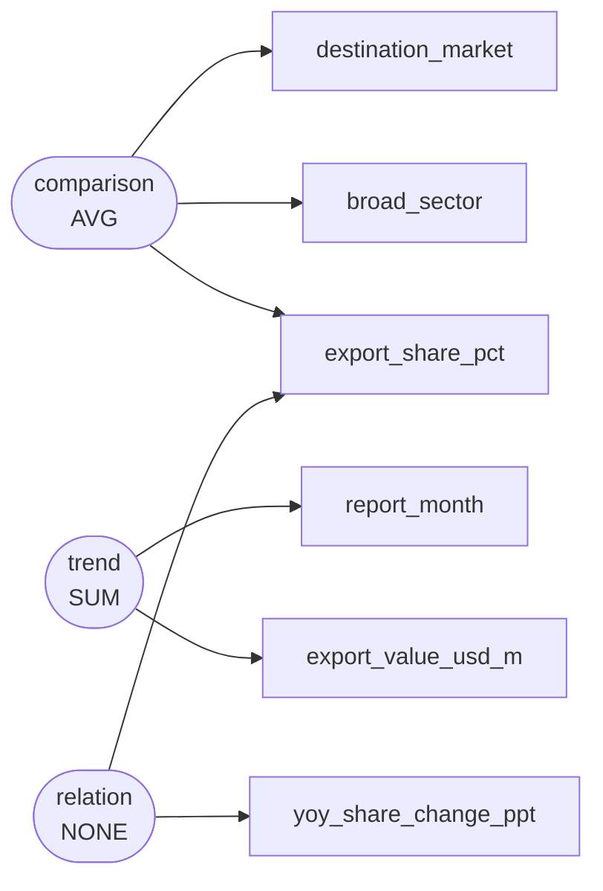

# Monthly merchandise export values and commodity group shares by destination economy, 2021-2023

The National Directorate of Statistics compiled customs trade declaration summaries from January 2021 through December 2023 to monitor structural shifts in merchandise export composition and evaluate national trade exposure across major trading partner economies.

`s001` -- 360 rows, 8 columns

Drawn from `dom_0299` Export share by product group -- merchandise trade balance and export shares by partner country and product group (macroeconomy and trade / official_statistics), simple

## Dimensions

## Numeric columns

## Intents

## What can be drawn

| family | drawable |
|---|---|
| comparison | yes |
| trend | yes |
| composition | yes |
| relation | yes |
| distribution | yes |
| process | no |

Densest two-column cross: destination_market x broad_sector at 30.0 rows per cell.

Gaps:

- No dimension is declared ordered="stage", so no process chart can be drawn. If this scenario has genuine sequential stages, declare that dimension as a stage; if it does not, leave it out rather than inventing one.
