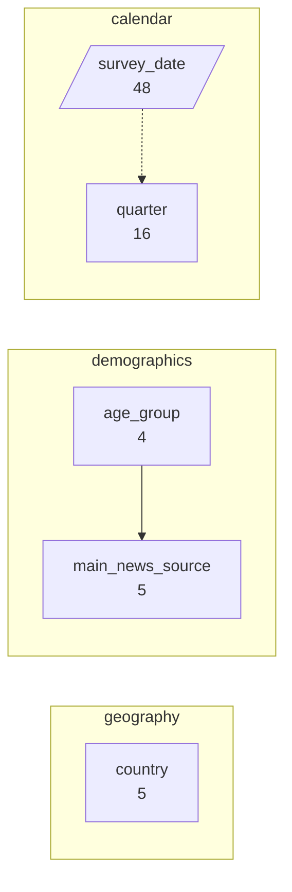
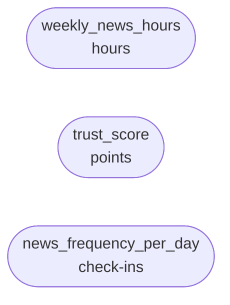
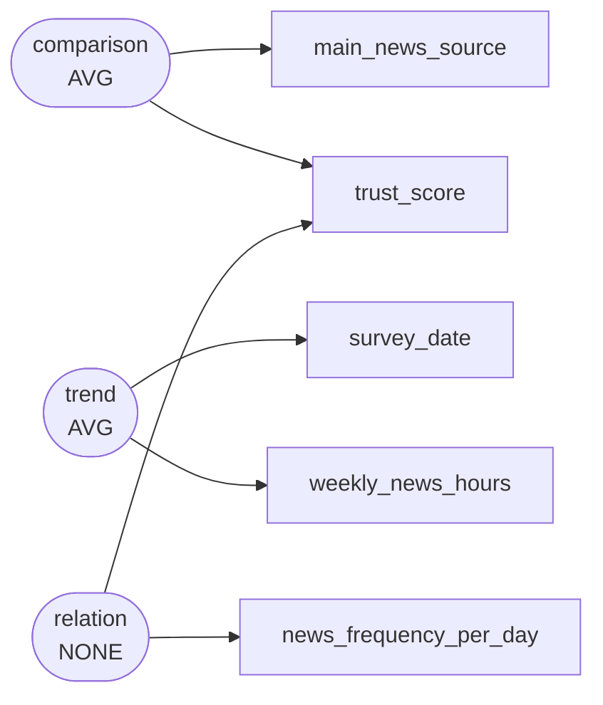

# Cross-national news consumption habits and media trust survey across five OECD nations, 2021–2024

An international media observatory and comparative research network conducted periodic population-weighted survey waves between January 2021 and December 2024 across five countries. The research tracks shifting reliance on digital channels versus traditional broadcasting, audience trust in primary information sources, and weekly engagement intensity.

`s002` -- 380 rows, 8 columns

Drawn from `dom_0591` Main source of news last week -- news consumption habits and trust in media sources across countries (culture, media and consumer / survey), simple

## Dimensions

## Numeric columns

## Intents

## What can be drawn

| family | drawable |
|---|---|
| comparison | yes |
| trend | yes |
| composition | yes |
| relation | yes |
| distribution | yes |
| process | no |

Densest two-column cross: country x age_group at 19.0 rows per cell.

Gaps:

- No dimension is declared ordered="stage", so no process chart can be drawn. If this scenario has genuine sequential stages, declare that dimension as a stage; if it does not, leave it out rather than inventing one.
