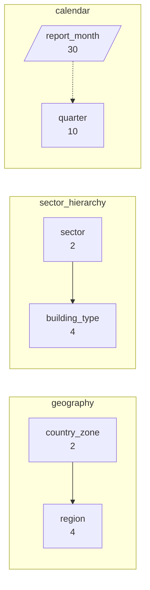
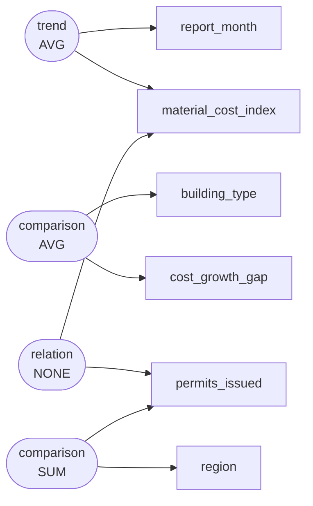

# Monthly construction cost indices and building permit issuances across regional markets by the National Statistics Bureau, 2022–2024

The National Statistics Bureau compiled monthly construction producer price indices, component input costs, and municipal building permit authorizations from January 2022 to June 2024. The data was collected under the national economic surveillance framework to evaluate cost push pressures, tracking how escalating material prices versus rising unionized labour rates affect residential and commercial building activity across macro-regions.

`s003` -- 720 rows, 10 columns

Drawn from `dom_0582` Labour vs material cost drivers in construction costs -- industry and technology: building permits issued, dwellings completed and construction cost indices by building type, region and quarter (industry and technology / official_statistics), medium

## Dimensions



## Numeric columns

```mermaid
flowchart LR
  material_cost_index([material_cost_index<br/>index (2021=100)])
  labour_cost_index([labour_cost_index<br/>index (2021=100)])
  cost_growth_gap([cost_growth_gap<br/>percentage points])
  permits_issued([permits_issued<br/>permits])
  labour_cost_index --> cost_growth_gap
  material_cost_index --> cost_growth_gap
```

## Intents



## What can be drawn

| family | drawable |
|---|---|
| comparison | yes |
| trend | yes |
| composition | yes |
| relation | yes |
| distribution | yes |
| process | no |

Densest two-column cross: country_zone x region at 90.0 rows per cell.

Gaps:

- No dimension is declared ordered="stage", so no process chart can be drawn. If this scenario has genuine sequential stages, declare that dimension as a stage; if it does not, leave it out rather than inventing one.
