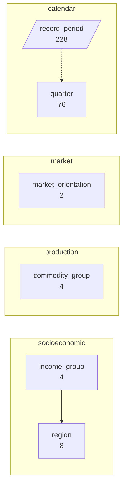
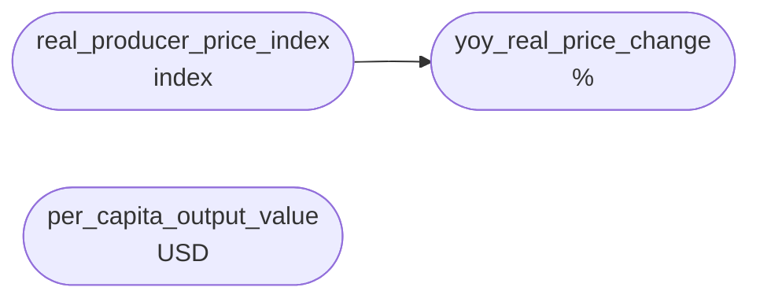
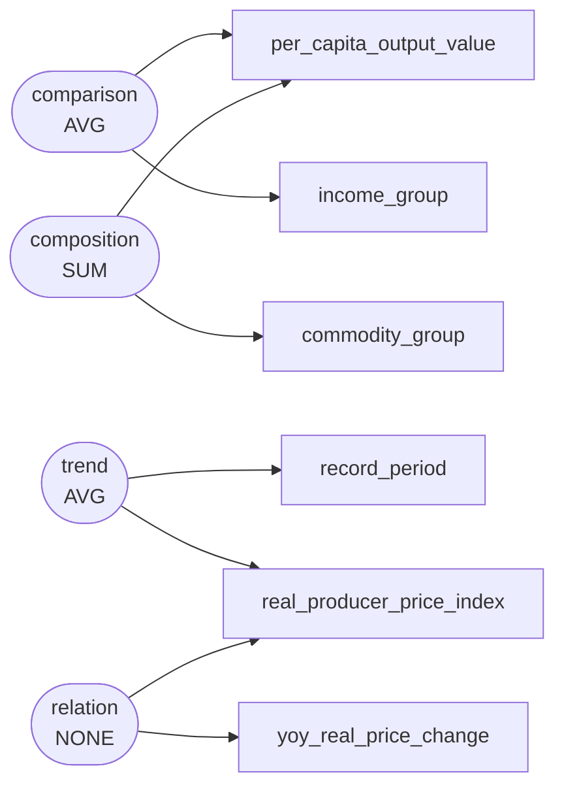

# Real agricultural producer price indices and per-capita output value by World Bank income tier and commodity group, 2005–2023

The Food and Agriculture Organization (FAO) Statistics Division compiled country-level agricultural producer prices deflated by consumer price indices alongside gross per-capita agricultural output from 2005 to 2023. The dataset evaluates terms of trade shocks, commodity-specific volatility, and structural agricultural output differences across global income classifications.

`s004` -- 1800 rows, 9 columns

Drawn from `dom_0482` Real producer prices and per-capita agricultural output value by income group -- food and agriculture: annual agricultural producer price indices and year-on-year change by commodity group and region (food and agriculture / official_statistics), complex

## Dimensions

## Numeric columns

## Intents

## What can be drawn

| family | drawable |
|---|---|
| comparison | yes |
| trend | yes |
| composition | yes |
| relation | yes |
| distribution | yes |
| process | no |

Densest two-column cross: income_group x market_orientation at 225.0 rows per cell.

Gaps:

- No dimension is declared ordered="stage", so no process chart can be drawn. If this scenario has genuine sequential stages, declare that dimension as a stage; if it does not, leave it out rather than inventing one.
