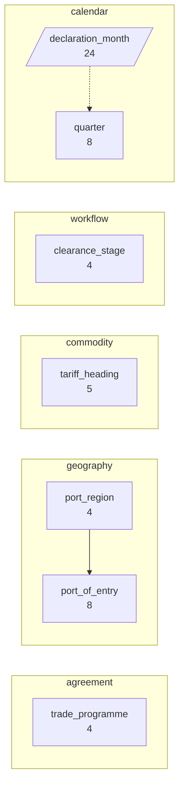
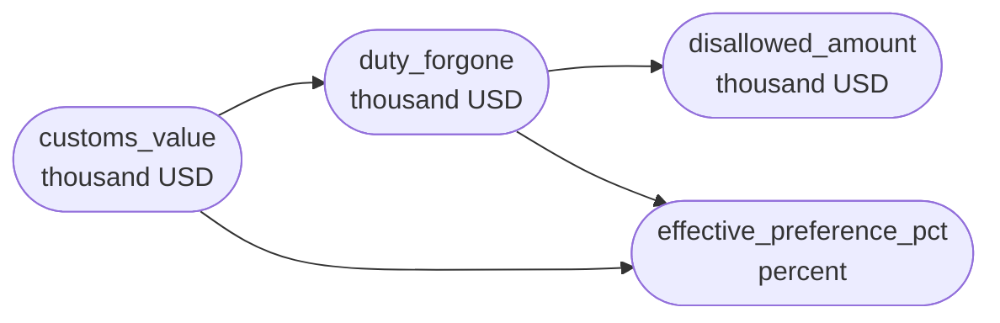
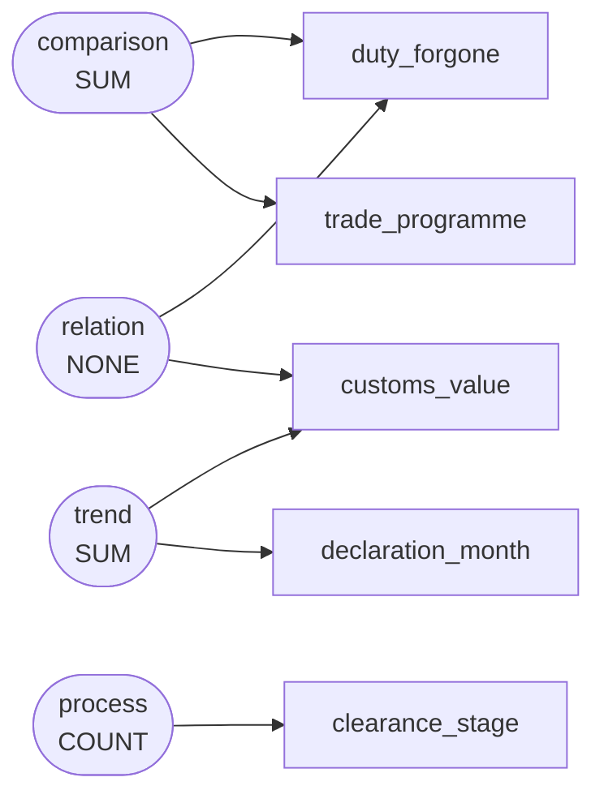

# Preferential trade agreement origin claims, duty forgone, and customs compliance verifications across major entry ports, 2022–2023

The national customs administration maintains this registry of monthly preferential tariff filings to monitor revenue forgone under free trade agreements, evaluate origin certification compliance across tariff headings, and track claims through clearance and audit stages.

`s005` -- 800 rows, 11 columns

Drawn from `dom_0308` Preferential origin claims and duty forgone under trade agreements -- macroeconomy and trade: customs import declarations and duty amounts assessed by tariff heading and port of entry (macroeconomy and trade / registry), medium

## Dimensions

## Numeric columns

## Intents

## What can be drawn

| family | drawable |
|---|---|
| comparison | yes |
| trend | yes |
| composition | yes |
| relation | yes |
| distribution | yes |
| process | yes |

Densest two-column cross: trade_programme x port_region at 50.0 rows per cell.
