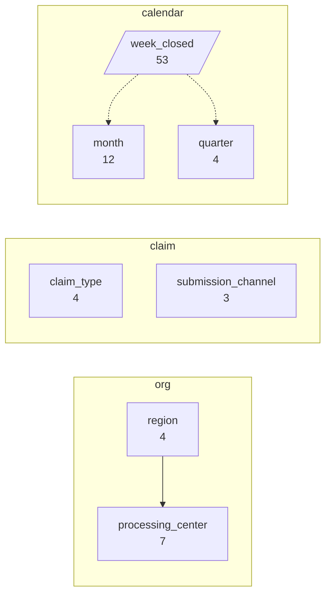
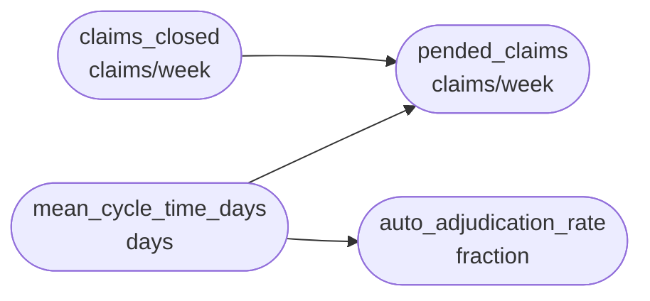
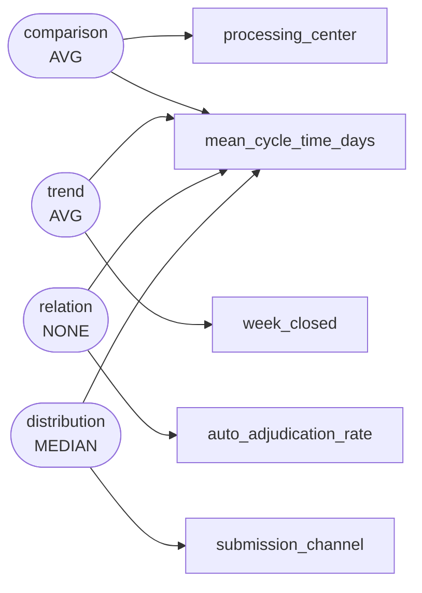

# Weekly claim turnaround performance across four regional processing centers of a national health insurer, January-December 2024

The claims operations analytics team of a national health insurer assembled this weekly batch-level extract covering all four regional processing centers for calendar year 2024. Each row is one weekly closing batch: a single center, claim type and submission channel combination that finished adjudication in that week. The data was pulled from the adjudication workflow log in January 2025 to support a service-level review, since the insurer had committed to a 14-day average turnaround and had rolled out an auto-adjudication rules engine at the start of the third quarter. Analysts wanted to know which centers were slow, whether electronic submissions really closed faster than paper, and whether turnaround was improving after the rollout.

`s000` -- 420 rows, 11 columns

## Dimensions

## Numeric columns

## Intents

## What can be drawn

| family | drawable |
|---|---|
| comparison | yes |
| trend | yes |
| composition | yes |
| relation | yes |
| distribution | yes |
| process | no |

Densest two-column cross: region x submission_channel at 35.0 rows per cell.

Gaps:

- No dimension is declared ordered="stage", so no process chart can be drawn. If this scenario has genuine sequential stages, declare that dimension as a stage; if it does not, leave it out rather than inventing one.
