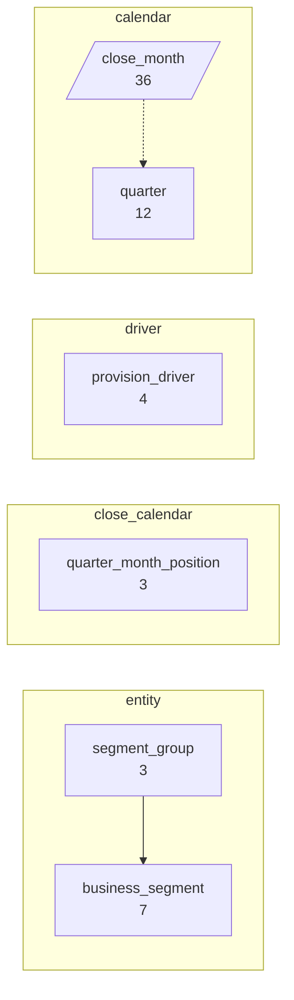
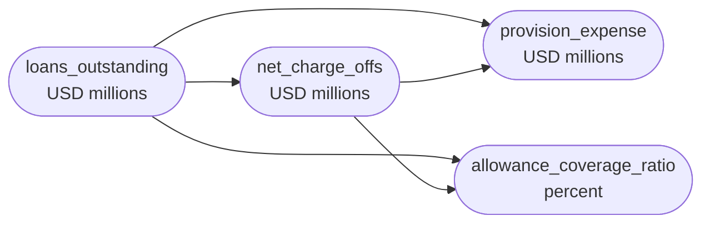
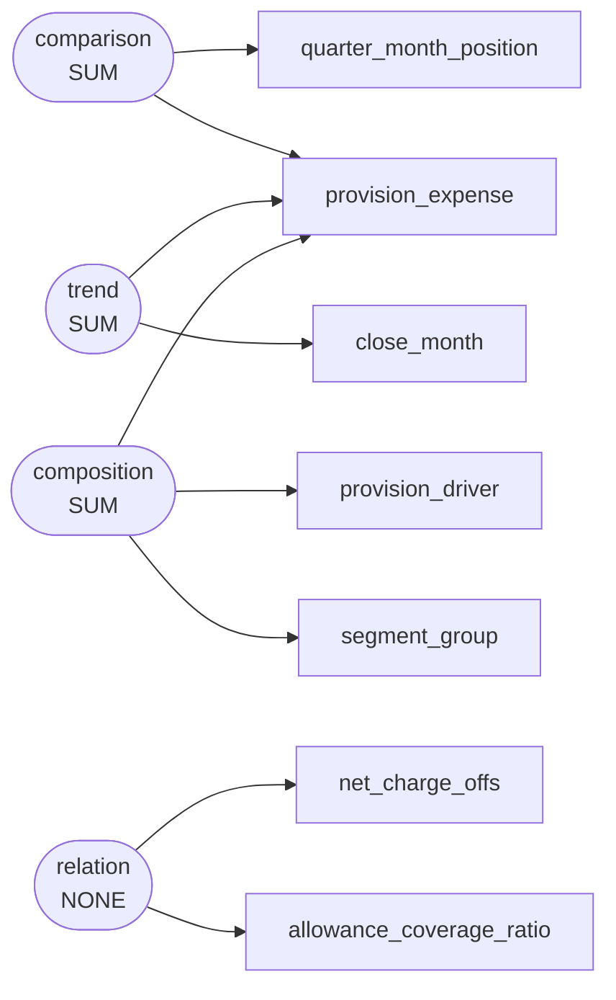

# Monthly loan loss provision build and allowance coverage across seven commercial banking segments, January 2022 to December 2024

The credit risk analytics team at a regional commercial bank assembled this table from the monthly allowance close package covering January 2022 through December 2024. Each row is a single provision posting made at a month-end close for one business segment, tagged with the driver cited in the allowance memo and with the segment's position in the quarterly reporting calendar. The data was pulled in early 2025 to support a review of why provision expense clusters in the final month of each quarter and how allowance coverage responded to the deterioration in charge-offs that began in late 2023.

`s001` -- 360 rows, 10 columns

## Dimensions

## Numeric columns

## Intents

## What can be drawn

| family | drawable |
|---|---|
| comparison | yes |
| trend | yes |
| composition | yes |
| relation | yes |
| distribution | yes |
| process | yes |

Densest two-column cross: segment_group x quarter_month_position at 40.0 rows per cell.
