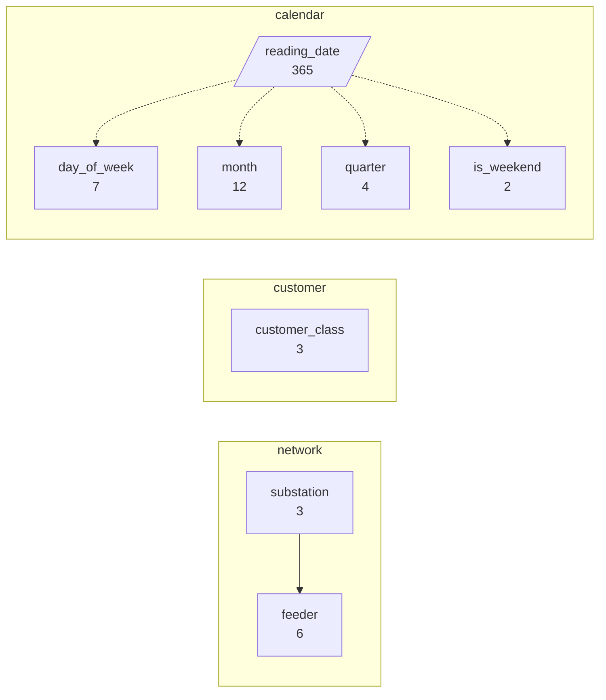
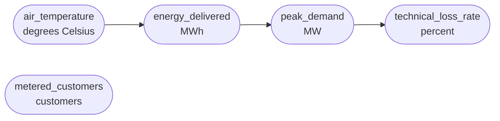
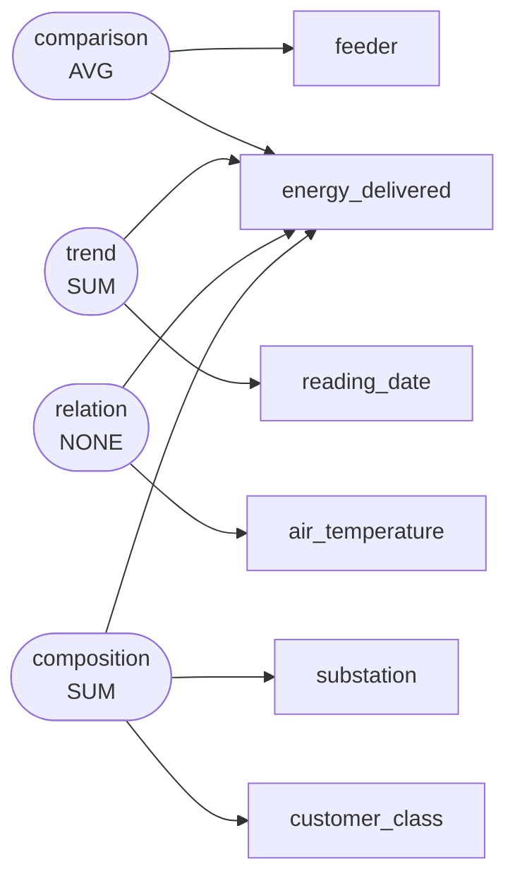

# Daily energy delivered on six residential distribution feeders across three substations, January-December 2023, examined by customer class and weather

The distribution planning group of a mid-sized municipal electric utility assembled this table from SCADA feeder meters and the customer information system for calendar year 2023. Each record is one settled daily reading for one feeder and one customer class, joined to the substation weather station and to the estimated technical loss factor. The dataset was built in early 2024 to support the annual load forecast, to see which feeders approach their thermal rating on hot afternoons, and to quantify how strongly residential energy responds to heating and cooling degree days before the utility commits to a feeder reconductoring budget.

`s002` -- 450 rows, 13 columns

## Dimensions

## Numeric columns

## Intents

## What can be drawn

| family | drawable |
|---|---|
| comparison | yes |
| trend | yes |
| composition | yes |
| relation | yes |
| distribution | yes |
| process | no |

Densest two-column cross: substation x is_weekend at 75.0 rows per cell.

Gaps:

- No dimension is declared ordered="stage", so no process chart can be drawn. If this scenario has genuine sequential stages, declare that dimension as a stage; if it does not, leave it out rather than inventing one.
