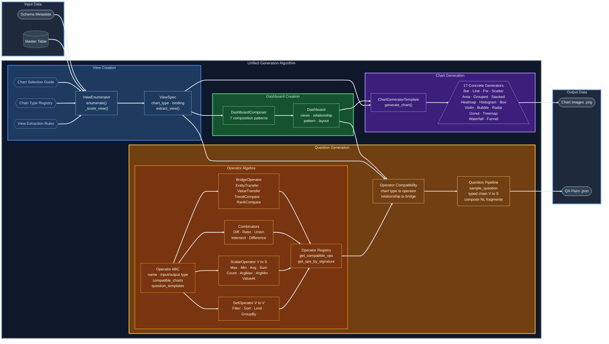

# Phase 3 — Chart QA & Dashboard Pipeline

Phase 3 takes a master dataset and schema metadata, enumerates all valid chart views, generates chart images, and produces single-chart (intra) and multi-chart (inter) QA pairs.



---

## Classes

### Core Data Model

**`ViewSpec`** — [view_spec.py](view_spec.py)
A dataclass describing one chart view: which chart type to render, how columns map to visual slots (binding), the extraction rule, and an optional filter. Key computed properties: `group_by`, `measure`, `agg`, `select_columns`. Has `extract_view(master_table)` to perform a SQL-like projection directly.

**`ViewData`** — [view_extractor.py](view_extractor.py)
Convenience wrapper that bundles a `ViewSpec`, the master `DataFrame`, and the result of running extraction. Immediately populates `extracted_view` on construction.

### Extraction & Enumeration

**`ViewExtractor`** — [view_extractor.py](view_extractor.py)
Handles the actual data projection (filter → group/aggregate → sort → select). Called internally by `ViewData`. Has special handling for time-series chart types via `time_series_utils`.

**`ViewEnumerator`** — [view_enumerator.py](view_enumerator.py)
Takes `schema_metadata` and a master `DataFrame`. Iterates every chart type in `VIEW_EXTRACTION_RULES`, generates all column-to-slot bindings via Cartesian product, validates structural constraints, and scores each valid `ViewSpec`. Returns a list sorted by suitability score (highest first).

### Dashboard Composition

**`Dashboard`** — [dashboard.py](dashboard.py)
Dataclass holding 2–4 `ViewSpec` objects that form a dashboard. Tracks `relationship` (e.g. `"dual_metric"`, `"drill_down"`), `pattern`, auto-derived `layout` (`"2x1"`, `"1x3"`, `"2x2"`), and accumulated `qa_pairs`. `to_dict()` serializes to JSON.

**`DashboardComposer`** — [dashboard_composer.py](dashboard_composer.py)
Composes `Dashboard` objects from enumerated views using named patterns:
- `same_type_compare` — same view split by time midpoint
- `overview_detail` — pie/bar overview + grouped/stacked bar detail
- `orthogonal_contrast` — same metric, different categorical dimension
- `dual_metric` — same grouping, different measures
- `distribution_cause` — distribution chart paired with scatter/bubble
- `cause_mediator_effect` — causal chain of 3 views
- `full_dashboard` — 4 views maximizing chart family diversity

### QA Generators

**`IntraQAGenerator`** — [intraQAGenerator/intra_qa_generator.py](intraQAGenerator/intra_qa_generator.py)
Generates QA pairs for a single chart from `INTRA_VIEW_TEMPLATES`. Templates include `value_retrieval`, `extremum`, `comparison`, `trend`, `proportion`, `distribution_shape`, and `correlation_direction`. Call `generate_all_qa(view_spec)` to get every applicable template for a chart type.

**`InterQAGenerator`** — [interQAGenerator/inter_qa_generator.py](interQAGenerator/inter_qa_generator.py)
Generates cross-chart QA pairs for a `Dashboard` from `INTER_VIEW_TEMPLATES`. Filters templates by `dashboard.relationship`. Templates include `ranking_consistency`, `conditional_lookup`, `trend_divergence`, `drilldown_verification`, `orthogonal_reasoning`, `causal_inference`, and `holistic_synthesis`.

**`PatternDetector`** — [pattern_detector.py](pattern_detector.py)
Scans a view's extracted data against patterns declared in the schema (e.g. `trend_break`, `outlier_entity`, `ranking_reversal`). Generates hard/very-hard QA pairs when a pattern is visible in a given view.

### Chart Generators

**`ChartGeneratorTemplate`** — [chartGenerator/chart_generator_template.py](chartGenerator/chart_generator_template.py)
Abstract base class for all chart renderers. Holds a `ViewData` object and a `config` dict (figsize, palette, fonts, dpi). Subclasses implement `generate_chart()` returning `(fig, ax)`.

Concrete generators in [chartGenerator/](chartGenerator/): `BarChartGenerator`, `LineChartGenerator`, `PieChartGenerator`, `ScatterPlotGenerator`, `AreaChartGenerator`, `GroupedBarChartGenerator`, `StackedBarChartGenerator`, `HeatmapGenerator`, `HistogramGenerator`, `BoxPlotGenerator`, `ViolinPlotGenerator`, `BubbleChartGenerator`, `RadarChartGenerator`, `DonutChartGenerator`, `TreemapGenerator`, `WaterfallChartGenerator`, `FunnelChartGenerator`.

### Supporting Registries

**`VIEW_EXTRACTION_RULES`** — [view_extraction_rules.py](view_extraction_rules.py)
Dict mapping chart type → SQL-like transform string, column binding role requirements, constraint string, and visual mapping. Used by `ViewEnumerator` and `ViewExtractor`.

**`CHART_TYPE_REGISTRY`** — [chart_type_registry.py](chart_type_registry.py)
Dict mapping chart type → expected row range, required column counts, data patterns, and QA capabilities. Used by `ViewEnumerator` during scoring.

**`CHART_SELECTION_GUIDE`** — [chart_selection_guide.py](chart_selection_guide.py)
Maps analytical intents to ranked chart recommendations. Used by `ViewEnumerator._score_view()`.

---

## Class Relationships

```
schema_metadata + master_data_3.csv
        │
        ▼
  ViewEnumerator.enumerate()
        │  uses VIEW_EXTRACTION_RULES, CHART_TYPE_REGISTRY, CHART_SELECTION_GUIDE
        │
        ▼
  List[ViewSpec]  ──────────────────────────────────────────────────────┐
        │                                                                │
        ▼                                                                │
  ViewData(view_spec, master_table)                                      │
    └─ ViewExtractor.extract_view()  →  extracted_view (DataFrame)       │
        │                                                                │
        ├──► ChartGeneratorTemplate.generate_chart()  →  (fig, ax)      │
        │                                                                │
        └──► IntraQAGenerator.generate_all_qa(view_spec)                │
               └─ INTRA_VIEW_TEMPLATES                                   │
                                                                         │
  DashboardComposer.compose(views, schema, k)  ◄────────────────────────┘
        │  groups ViewSpecs by composition pattern
        ▼
  List[Dashboard]
        │
        └──► InterQAGenerator.generate_all_qa(dashboard)
               └─ INTER_VIEW_TEMPLATES
```

---

## How to Run Single Chart QA and Image Pipeline

This section walks through running the full pipeline — chart image generation + QA — using **example dataset 3** (`master_data_3.csv` / `schema_metadata_3.json`). Dataset 3 is a retail sales dataset with columns: `region`, `segment`, `category`, `brand`, `order_date`, `revenue`, `discount`, `shipping_cost`, `quantity`.

Run all commands from inside the `phase_3/` directory.

### Step 1 — Load data and schema

```python
import json
import pandas as pd
import os, sys
sys.path.insert(0, os.path.dirname(__file__))  # ensure phase_3/ is on path

# Load dataset 3
master_table = pd.read_csv("example_data/master_data_3.csv")

with open("example_data/schema_metadata_3.json") as f:
    schema_metadata = json.load(f)
```

### Step 2 — Enumerate feasible views

```python
from view_enumerator import ViewEnumerator
from view_extractor import ViewData

enumerator = ViewEnumerator()
views = enumerator.enumerate(schema_metadata, master_table)
print(f"Enumerated {len(views)} feasible views")

# Populate extracted_view on each ViewSpec
for v in views:
    try:
        vd = ViewData(v, master_table)
        v.extracted_view = vd.extracted_view
    except Exception as e:
        print(f"  Skipping {v.chart_type}: {e}")

views = [v for v in views if v.extracted_view is not None]
```

### Step 3 — Generate a chart image

Each chart type has a corresponding generator class in [chartGenerator/](chartGenerator/). Pass a `ViewData` object to the constructor, then call `generate_chart()`.

```python
import matplotlib.pyplot as plt
from chartGenerator.bar_chart_generator import BarChartGenerator

# Pick the top-scored bar chart view
bar_view = next(v for v in views if v.chart_type == "bar_chart")
vd = ViewData(bar_view, master_table)

gen = BarChartGenerator(vd)
fig, ax = gen.generate_chart()

os.makedirs("output", exist_ok=True)
fig.savefig("output/bar_chart.png", bbox_inches="tight")
plt.close(fig)
print("Saved output/bar_chart.png")
```

To generate images for all enumerated views in one pass:

```python
from chartGenerator.bar_chart_generator import BarChartGenerator
from chartGenerator.line_chart_generator import LineChartGenerator
from chartGenerator.pie_chart_generator import PieChartGenerator
# ... import others as needed

GENERATOR_MAP = {
    "bar_chart": BarChartGenerator,
    "line_chart": LineChartGenerator,
    "pie_chart": PieChartGenerator,
    # add other chart types here
}

os.makedirs("output/charts", exist_ok=True)

for i, v in enumerate(views[:20]):  # limit to top 20
    gen_cls = GENERATOR_MAP.get(v.chart_type)
    if gen_cls is None:
        continue
    try:
        vd = ViewData(v, master_table)
        gen = gen_cls(vd)
        fig, ax = gen.generate_chart()
        fname = f"output/charts/view_{i}_{v.chart_type}.png"
        fig.savefig(fname, bbox_inches="tight")
        plt.close(fig)
        print(f"  Saved {fname}")
    except Exception as e:
        print(f"  Error on {v.chart_type}: {e}")
```

### Step 4 — Generate single-chart (intra) QA

```python
from intraQAGenerator.intra_qa_generator import IntraQAGenerator

intra_gen = IntraQAGenerator()

all_qa = []
for v in views[:20]:
    if v.extracted_view is None or v.extracted_view.empty:
        continue
    qa_pairs = intra_gen.generate_all_qa(v)
    for qa in qa_pairs:
        all_qa.append({
            "chart_type": v.chart_type,
            "binding": v.binding,
            **qa
        })

print(f"Generated {len(all_qa)} intra-view QA pairs")

# Optionally save
import json
with open("output/intra_qa.json", "w") as f:
    json.dump(all_qa, f, indent=2, default=str)
```

### Full end-to-end script

Save the following as `run_single_chart_pipeline.py` inside `phase_3/` and run:

```bash
cd phase_3
python run_single_chart_pipeline.py
```

```python
import json, os, sys
sys.path.insert(0, os.path.dirname(__file__))

import pandas as pd
import matplotlib.pyplot as plt

from view_enumerator import ViewEnumerator
from view_extractor import ViewData
from intraQAGenerator.intra_qa_generator import IntraQAGenerator
from chartGenerator.bar_chart_generator import BarChartGenerator
from chartGenerator.line_chart_generator import LineChartGenerator
from chartGenerator.pie_chart_generator import PieChartGenerator

GENERATOR_MAP = {
    "bar_chart": BarChartGenerator,
    "line_chart": LineChartGenerator,
    "pie_chart": PieChartGenerator,
}

master_table = pd.read_csv("example_data/master_data_3.csv")
with open("example_data/schema_metadata_3.json") as f:
    schema_metadata = json.load(f)

enumerator = ViewEnumerator()
views = enumerator.enumerate(schema_metadata, master_table)

for v in views:
    try:
        vd = ViewData(v, master_table)
        v.extracted_view = vd.extracted_view
    except Exception:
        pass

views = [v for v in views if v.extracted_view is not None]
print(f"{len(views)} feasible views")

os.makedirs("output/charts", exist_ok=True)
intra_gen = IntraQAGenerator()
all_qa = []

for i, v in enumerate(views[:20]):
    # Generate chart image
    gen_cls = GENERATOR_MAP.get(v.chart_type)
    if gen_cls:
        try:
            fig, ax = gen_cls(ViewData(v, master_table)).generate_chart()
            fig.savefig(f"output/charts/view_{i}_{v.chart_type}.png", bbox_inches="tight")
            plt.close(fig)
        except Exception as e:
            print(f"  Chart error [{v.chart_type}]: {e}")

    # Generate QA
    for qa in intra_gen.generate_all_qa(v):
        all_qa.append({"chart_type": v.chart_type, "binding": v.binding, **qa})

print(f"{len(all_qa)} QA pairs generated")
with open("output/intra_qa.json", "w") as f:
    json.dump(all_qa, f, indent=2, default=str)
print("Saved output/intra_qa.json")
```

### Inter-chart (dashboard) QA demo

To run the existing cross-chart QA demo (uses a built-in schema, not dataset 3, but demonstrates all `InterQAGenerator` templates):

```bash
cd phase_3
python run_inter_qa_demo.py
```
