# Phase 3 — Class Relationship Diagram

```mermaid
classDiagram
    direction TB

    %% ── Core Data Model ──────────────────────────────────────────────────────
    class ViewSpec {
        <<dataclass>>
        +str chart_type
        +Dict binding
        +Dict rule
        +float score
        +Optional[str] filter
        +DataFrame extracted_view
        +family : str
        +measure : str
        +group_by : List[str]
        +extract_view(master_table) DataFrame
        +with_filter(condition) ViewSpec
        +uses_role(role) bool
        +filter_compatible(target) bool
    }

    class ViewExtractor {
        +ViewSpec view_spec
        +extract_view(master_table) DataFrame
    }

    class ViewData {
        +ViewSpec view_spec
        +DataFrame master_table
        +ViewExtractor view_extractor
        +DataFrame extracted_view
    }

    class Dashboard {
        <<dataclass>>
        +List[ViewSpec] views
        +str relationship
        +str pattern
        +Optional[str] title
        +Optional[str] layout
        +List qa_pairs
        +score : float
        +chart_families : List[str]
        +family_diversity : int
        +add_qa(qa) None
        +to_dict() Dict
        +summary() str
    }

    %% ── Enumeration & Composition ────────────────────────────────────────────
    class ViewEnumerator {
        +enumerate(schema_metadata, master_table) List[ViewSpec]
        -_score_view(view_spec, ...) float
        -_group_columns_by_role(schema) Dict
        -_enumerate_bindings(required_roles, cols_by_role) List[Dict]
        -_check_constraint(view_spec, master_table) bool
        -_pattern_visible(pattern, view_spec) bool
    }

    class DashboardComposer {
        +COMPOSITION_PATTERNS : Dict
        +compose(feasible_views, schema_metadata, k) List[Dashboard]
        -_match_pattern(pattern, views, schema) List[Dashboard]
        -_build_causal_chain(deps, corrs, views) List[ViewSpec]
        -_maximize_type_diversity(views, k) List[ViewSpec]
        -_has_temporal(view) bool
        -_find_view_for_measure(views, measure) ViewSpec
    }

    %% ── QA Generation ────────────────────────────────────────────────────────
    class IntraQAGenerator {
        +Dict templates
        +generate_qa(view_spec) Tuple[str,str]
        +generate_all_qa(view_spec) List[dict]
        -_apply_template(name, data, view_spec, df) Tuple
    }

    class InterQAGenerator {
        +Dict templates
        +generate_qa(dashboard) Tuple[str,str]
        +generate_all_qa(dashboard) List[dict]
        -_apply_ranking_consistency() Tuple
        -_apply_causal_inference() Tuple
        -_apply_holistic_synthesis() Tuple
        -_apply_template(name, data, dashboard) Tuple
    }

    class PatternDetector {
        +detect_and_generate_qa(view_df, view_spec, patterns) List[QAPair]
        -_pattern_visible_in_view(pattern, view_spec) bool
        -_generate_pattern_qa(pattern, view_df, view_spec) List[QAPair]
        -_extract_entity(target_filter) str
    }

    %% ── Chart Generation ─────────────────────────────────────────────────────
    class ChartGeneratorTemplate {
        <<abstract>>
        +ViewData view_data
        +ViewSpec view_spec
        +DataFrame extracted_view
        +Dict config
        +chart_type* : str
        +generate_chart()*
        +update_config(**kwargs)
        -_apply_layout_adjustments(fig, ax)
    }

    class ConcreteChartGenerators {
        BarChartGenerator
        LineChartGenerator
        PieChartGenerator
        ScatterPlotGenerator
        HistogramGenerator
        HeatmapGenerator
        AreaChartGenerator
        BoxPlotGenerator
        BubbleChartGenerator
        DonutChartGenerator
        FunnelChartGenerator
        GroupedBarChartGenerator
        RadarChartGenerator
        StackedBarChartGenerator
        TreemapGenerator
        ViolinPlotGenerator
        WaterfallChartGenerator
    }

    %% ── Reference Data (Constants) ───────────────────────────────────────────
    class CHART_TYPE_REGISTRY {
        <<registry>>
        16 chart-type definitions
        family · row_range
        required_columns
        data_patterns · qa_capabilities
    }

    class CHART_SELECTION_GUIDE {
        <<registry>>
        15 analytical intents
        data_shape predicates
        ranked chart recommendations
    }

    class VIEW_EXTRACTION_RULES {
        <<registry>>
        16 extraction specs
        transform · column_binding
        constraints · visual_mapping
    }

    class INTRA_VIEW_TEMPLATES {
        <<registry>>
        7 QA templates
        value_retrieval · extremum
        comparison · trend
        proportion · distribution_shape
        correlation_direction
    }

    class INTER_VIEW_TEMPLATES {
        <<registry>>
        7 QA templates
        ranking_consistency
        conditional_lookup
        trend_divergence
        drilldown_verification
        orthogonal_reasoning
        causal_inference
        holistic_synthesis
    }

    %% ── Utility Functions ────────────────────────────────────────────────────
    class time_series_utils {
        <<module>>
        +reduce_time_series(df, time_col, group_cols, agg_dict) DataFrame
    }

    %% ── Relationships ────────────────────────────────────────────────────────

    %% Composition
    ViewData *-- ViewSpec : contains
    ViewData *-- ViewExtractor : contains
    Dashboard *-- ViewSpec : contains list

    %% Usage
    ViewExtractor ..> ViewSpec : uses
    ViewExtractor ..> time_series_utils : uses

    %% Enumeration produces
    ViewEnumerator ..> ViewSpec : produces
    ViewEnumerator ..> ViewData : uses
    ViewEnumerator ..> CHART_TYPE_REGISTRY : consults
    ViewEnumerator ..> CHART_SELECTION_GUIDE : consults
    ViewEnumerator ..> VIEW_EXTRACTION_RULES : consults

    %% Composition produces
    DashboardComposer ..> ViewSpec : takes
    DashboardComposer ..> Dashboard : produces

    %% QA generation
    IntraQAGenerator ..> ViewSpec : takes
    IntraQAGenerator ..> INTRA_VIEW_TEMPLATES : uses
    InterQAGenerator ..> Dashboard : takes
    InterQAGenerator ..> INTER_VIEW_TEMPLATES : uses
    PatternDetector ..> ViewSpec : uses

    %% Chart generation
    ChartGeneratorTemplate *-- ViewData : takes
    ChartGeneratorTemplate ..> VIEW_EXTRACTION_RULES : uses
    ChartGeneratorTemplate ..> INTRA_VIEW_TEMPLATES : uses
    ConcreteChartGenerators --|> ChartGeneratorTemplate : inherit
```

---

## Architectural Layers

| Layer | Classes / Modules |
|---|---|
| **Reference Data** | `CHART_TYPE_REGISTRY`, `CHART_SELECTION_GUIDE`, `VIEW_EXTRACTION_RULES`, `INTRA_VIEW_TEMPLATES`, `INTER_VIEW_TEMPLATES` |
| **Core Model** | `ViewSpec`, `ViewExtractor`, `ViewData`, `Dashboard` |
| **Pipeline** | `ViewEnumerator` → `DashboardComposer` |
| **QA Generation** | `IntraQAGenerator`, `InterQAGenerator`, `PatternDetector` |
| **Chart Generation** | `ChartGeneratorTemplate` (ABC) ← 17 concrete generators |
| **Utilities** | `time_series_utils.reduce_time_series` |

## Relationship Key

| Symbol | Meaning |
|---|---|
| `*--` | Composition (owns / contains) |
| `..>` | Dependency (uses / consults) |
| `--|>` | Inheritance |
