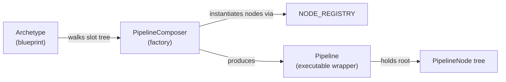
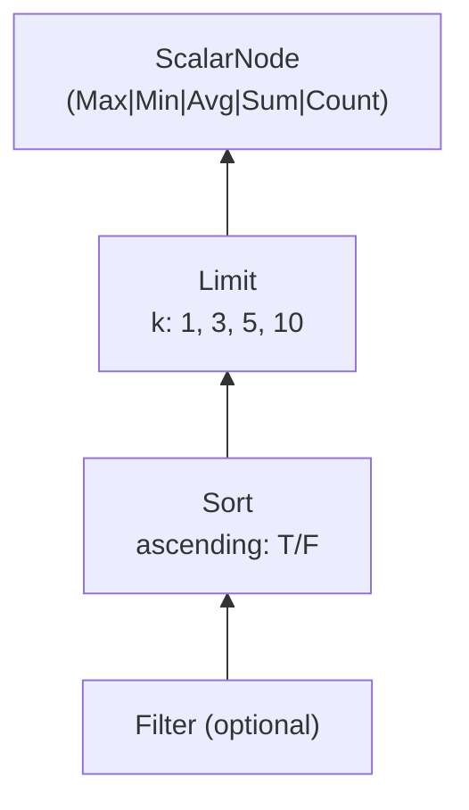
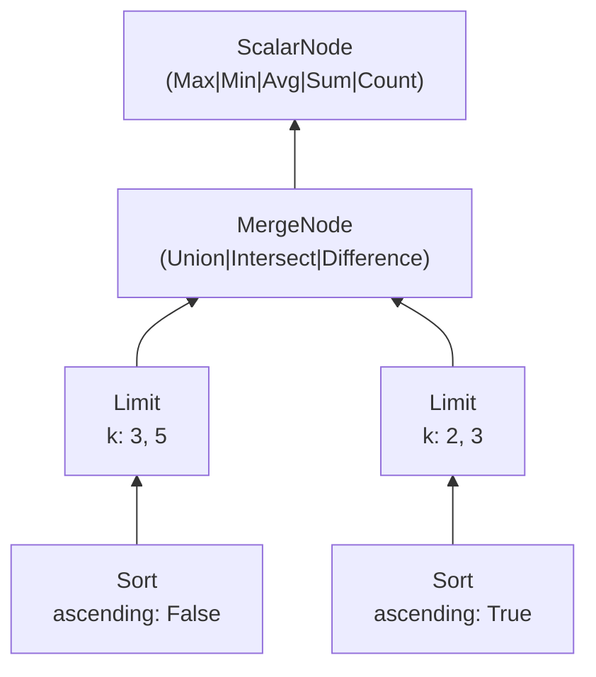
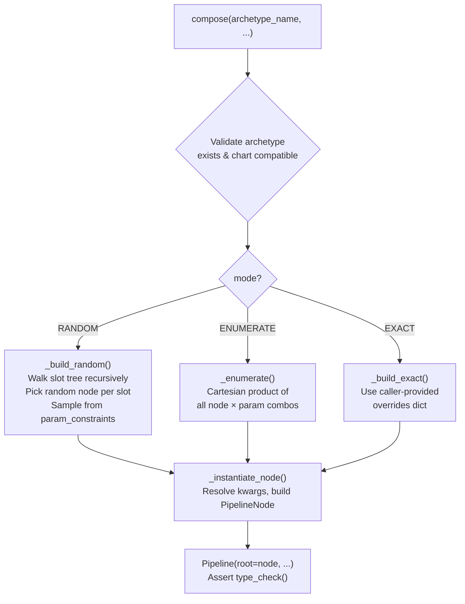
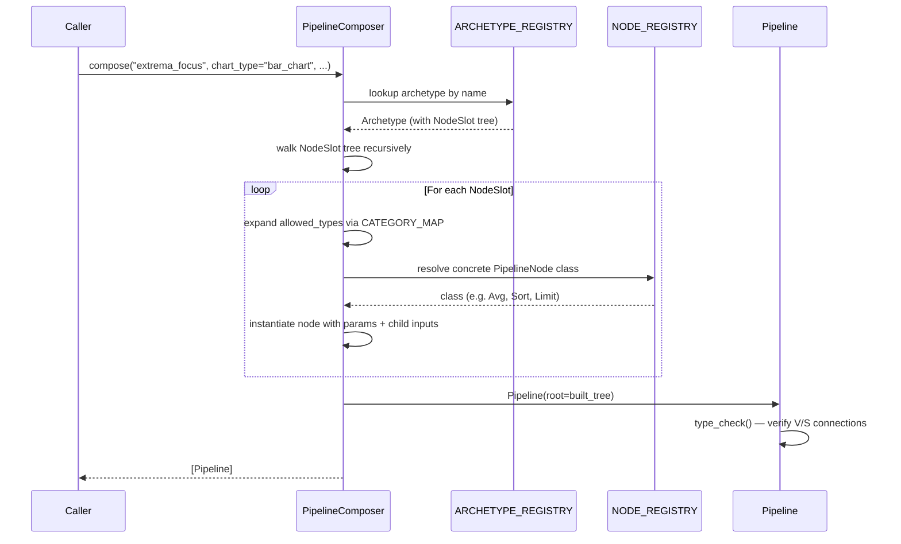

# Archetypes System Summary

> How `Archetype` blueprints are composed into executable `Pipeline` objects.

---

## High-Level Architecture



**In one sentence:** An `Archetype` declares the *shape* of a valid pipeline using abstract `NodeSlot`s; the `PipelineComposer` reads that shape, resolves each slot to a concrete `PipelineNode`, and wraps the result in an executable `Pipeline`.

---

## Class Breakdown

### 1. `NodeSlot` — [archetypes.py](file:///Users/bryantbettencourt/my-venv/research/chartAgentVAGEN/phase_3/question_pipeline/archetypes.py#L28-L84)

A recursive dataclass representing a single position in an archetype's slot tree.

| Field | Type | Purpose |
|---|---|---|
| `allowed_types` | `List[str]` | Node class names or category tags that can fill this slot (e.g. `"Filter"`, `"ScalarNode"`) |
| `inputs` | `List[NodeSlot]` | Child slots — empty = leaf, 1 = unary/sequential, 2 = binary/fork |
| `optional` | `bool` | If `True`, the composer may skip this slot during random composition |
| `param_constraints` | `Dict[str, List[Any]]` | Hard constraints on constructor kwargs (e.g. `{"k": [1, 3, 5]}`) |

**Key properties:**
- `is_leaf` — no child inputs
- `is_binary` — merges two branches
- `display()` — pretty-prints the slot tree

---

### 2. `Archetype` — [archetypes.py](file:///Users/bryantbettencourt/my-venv/research/chartAgentVAGEN/phase_3/question_pipeline/archetypes.py#L89-L123)

A named pipeline blueprint with chart compatibility rules.

| Field | Type | Purpose |
|---|---|---|
| `name` | `str` | Human-readable ID (e.g. `"extrema_focus"`) |
| `description` | `str` | What question pattern this archetype produces |
| `compatible_charts` | `List[str]` | Chart types this archetype is valid for |
| `structure` | `NodeSlot` | Root of the slot tree — the composer recursively walks this |
| `pipeline_type` | `str` | Label: `"sequential"`, `"forked"`, or `"nested"` |

---

### 3. `CATEGORY_MAP` — [archetypes.py](file:///Users/bryantbettencourt/my-venv/research/chartAgentVAGEN/phase_3/question_pipeline/archetypes.py#L131-L138)

Maps category shorthand names to lists of concrete node class names. Used by the composer to expand a slot like `["ScalarNode"]` into `["Max", "Min", "Avg", "Sum", "Count"]`.

| Category | Expands To |
|---|---|
| `SetNode` | Filter, Sort, Limit, GroupBy |
| `ScalarNode` | Max, Min, Avg, Sum, Count |
| `ArgNode` | ArgMax, ArgMin |
| `ReduceNode` | Max, Min, Avg, Sum, Count, ArgMax, ArgMin, ValueAt |
| `MergeNode` | Union, Intersect, Difference |
| `ScalarMerge` | Diff, Ratio |

---

### 4. Concrete Archetypes

#### `EXTREMA_FOCUS` — sequential pipeline

```
Shape:  [Filter?] → Sort → Limit → [ScalarNode]
```

> "What is the {max/avg/sum} {measure} of the top {k} {entities} [where {col} {op} {val}]?"



- **pipeline_type:** `"sequential"`
- **compatible_charts:** bar_chart, grouped_bar_chart, stacked_bar_chart, scatter_plot, bubble_chart

---

#### `COMPARATIVE_FORK` — forked pipeline

```
Shape:  Branch A: Sort(desc) → Limit
        Branch B: Sort(asc)  → Limit
        Merge:    [MergeNode](A, B) → [ScalarNode]
```

> "How many {entities} appear in the top-{a} or bottom-{b} by {measure}?"



- **pipeline_type:** `"forked"`
- **compatible_charts:** bar_chart, grouped_bar_chart, stacked_bar_chart, scatter_plot, bubble_chart

---

### 5. `ARCHETYPE_REGISTRY` — [archetypes.py](file:///Users/bryantbettencourt/my-venv/research/chartAgentVAGEN/phase_3/question_pipeline/archetypes.py#L242-L253)

A simple `Dict[str, Archetype]` mapping names to archetype instances:

```python
ARCHETYPE_REGISTRY = {
    "extrema_focus":    EXTREMA_FOCUS,
    "comparative_fork": COMPARATIVE_FORK,
}
```

**Helper:** `get_archetypes_for_chart(chart_type)` filters the registry to archetypes compatible with a given chart type.

---

### 6. `Pipeline` — [pipeline.py](file:///Users/bryantbettencourt/my-venv/research/chartAgentVAGEN/phase_3/question_pipeline/pipeline.py)

A thin wrapper that holds a root `PipelineNode` tree plus metadata. All heavy lifting delegates to the root node.

| Field | Type | Purpose |
|---|---|---|
| `root` | `PipelineNode` | Root of the concrete node tree (outermost/final node) |
| `view_specs` | `List[Any]` | ViewSpec metadata context |
| `pipeline_type` | `str` | `"sequential"`, `"forked"`, `"nested"`, or `"multi_chart"` |
| `relationship` | `str` | Inter-chart relationship (multi-chart only) |

**Delegated methods:**
- `execute(view)` → runs the tree on a DataFrame, returns `NodeResult`
- `render_question(**ctx)` → composes NL question from node templates
- `display()` → indented tree string for debugging
- `type_check()` → verifies all type connections are valid
- `to_dict()` / `to_json()` → serialization

---

### 7. `PipelineComposer` — [pipeline_composer.py](file:///Users/bryantbettencourt/my-venv/research/chartAgentVAGEN/phase_3/question_pipeline/pipeline_composer.py#L100-L509)

Factory class that builds `Pipeline` objects from `Archetype` blueprints.

#### `compose()` — the single public API

```python
composer = PipelineComposer()
pipes = composer.compose(
    "extrema_focus",
    chart_type="bar_chart",
    measure_col="revenue",
    mode="RANDOM",          # or "ENUMERATE" or "EXACT"
)
```

| Parameter | Purpose |
|---|---|
| `archetype_name` | Key into `ARCHETYPE_REGISTRY` |
| `chart_type` | Filters which concrete nodes are compatible |
| `measure_col` | Default column name for Sort, Max, Avg, etc. |
| `mode` | Composition strategy (see below) |
| `overrides` | For `EXACT` mode — pin every slot choice |
| `skip_probability` | Chance of skipping optional slots in `RANDOM` mode |

#### Three Composition Modes

| Mode | Behavior | Returns |
|---|---|---|
| **`RANDOM`** | Randomly samples one valid node per slot; optional slots may be skipped | Single `Pipeline` in a list |
| **`ENUMERATE`** | Cartesian product of all valid node/param combinations at every slot | Many `Pipeline`s (only those passing `type_check`) |
| **`EXACT`** | Caller provides explicit overrides for every slot via dot-paths (`"root.0.0"`) | Single `Pipeline` in a list |

#### Internal Flow



**`_instantiate_node()`** resolves constructor parameters in priority order:
1. `exact_params` (from EXACT mode or enumeration)
2. Random sample from `param_constraints`
3. Default inference from `measure_col`

---

## End-to-End Data Flow



---

## PipelineNode Hierarchy (for reference)

All concrete nodes live in [pipelineNodes/](file:///Users/bryantbettencourt/my-venv/research/chartAgentVAGEN/phase_3/pipelineNodes) and are registered in [registry.py](file:///Users/bryantbettencourt/my-venv/research/chartAgentVAGEN/phase_3/pipelineNodes/registry.py):

```
PipelineNode (ABC)
├── SetNode (V → V)          : Filter, Sort, Limit, GroupBy
├── ScalarNode (V → S)       : Max, Min, Avg, Sum, Count, ArgMax, ArgMin, ValueAt
├── ScalarCombinatorNode (S,S → S) : Diff, Ratio
├── ViewCombinatorNode (V,V → V)   : Union, Intersect, Difference
└── BridgeNode (mixed)             : EntityTransfer, ValueTransfer, TrendCompare, RankCompare
```

Each node carries typed signatures (`input_type` / `output_type` of `"V"` or `"S"`) that `Pipeline.type_check()` validates at composition time.
