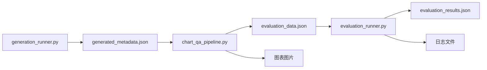

# Pipeline 文件说明文档

本文档详细说明 `pipeline/` 目录下 5 个文件的功能、输入输出关系及使用方法。

---

## 文件概览

| 文件名 | 类型 | 主要功能 |
|--------|------|----------|
| `generation_pipeline.py` | 核心库 | 数据生成管道核心逻辑（4个节点） |
| `generation_runner.py` | 可执行脚本 | 数据生成运行器（命令行接口） |
| `chart_qa_pipeline.py` | 可执行脚本 | 图表绘制 + QA生成管道 |
| `evaluation_pipeline.py` | 核心库 | VLM评估管道核心逻辑 |
| `evaluation_runner.py` | 可执行脚本 | 评估运行器（命令行接口） |

---

## 完整工作流程



---

## 1. generation_pipeline.py

### 文件类型
核心库文件（不直接运行）

### 功能描述
定义了完整的数据生成管道架构，包含 4 个节点：
- **Node A (TopicAgent)**: 在指定类别内生成主题概念
- **Node B (DataFabricator)**: 生成统计数据
- **Node C (SchemaMapper)**: 转换为 BAR/SCATTER/PIE 图表格式
- **Node D (RLCaptioner)**: 生成图表描述文字

### 主要类
- `ChartAgentPipeline`: 管道编排器
- `LLMClient`: 统一LLM客户端（支持 OpenAI, Gemini 等）
- `NodeA_TopicAgent`, `NodeB_DataFabricator`, `NodeC_SchemaMapper`, `NodeD_RLCaptioner`

### 输入/输出
**输入**: 无直接文件输入（通过代码调用）
- 参数：`category_id` (1-30)
- 可选约束参数

**输出**: Python 字典对象 (`PipelineState`)
```python
{
    "category_id": int,
    "category_name": str,
    "semantic_concept": str,
    "master_data": dict,
    "chart_entries": {
        "bar": {...},
        "scatter": {...},
        "pie": {...}
    },
    "captions": {...}
}
```

### 依赖
- `google-genai` (用于 Gemini)
- `openai` (用于 OpenAI 或兼容API)

---

## 2. generation_runner.py

### 文件类型
可执行命令行脚本

### 功能描述
数据生成管道的运行器，提供命令行接口来批量生成元数据。

### 输入

#### 命令行参数
```bash
python generation_runner.py --category <ID> --count <N> [OPTIONS]
```

**必需参数**:
- `--category <ID>`: 类别ID (1-30)，或
- `--categories <ID1,ID2,...>`: 多个类别ID（逗号分隔）

**可选参数**:
- `--count <N>`: 生成数量（默认1）
- `--provider <PROVIDER>`: LLM提供商 (openai/gemini/gemini-native)
- `--model <MODEL>`: 模型名称
- `--api-key <KEY>`: API密钥
- `--output <PATH>`: 输出文件路径（默认 `generated_metadata.json`）
- `--seed <N>`: 随机种子
- `--quiet`: 静默模式

#### 环境变量（.env 文件）
```bash
# OpenAI
OPENAI_API_KEY=sk-...
OPENAI_MODEL=gpt-4o

# Gemini
GEMINI_API_KEY=your-key
GEMINI_MODEL=gemini-2.0-flash-lite
```

### 输出

#### 主要输出文件
**位置**: `./generated_metadata.json` (默认)

**格式**: JSON 数组
```json
[
  {
    "generation_id": "gen_20240129_a1b2c3",
    "category_id": 1,
    "category_name": "1 - Media & Entertainment",
    "semantic_concept": "Streaming platform subscriber growth 2020-2024",
    "topic_description": "...",
    "master_data": { ... },
    "chart_entries": {
      "bar": { ... },
      "scatter": { ... },
      "pie": { ... }
    },
    "captions": { ... },
    "timestamp": "2024-01-29T10:30:00"
  },
  ...
]
```

### 使用示例
```bash
# 生成 5 个媒体娱乐类数据
python generation_runner.py --category 1 --count 5

# 从多个类别各生成一个
python generation_runner.py --categories 1,4,10,15

# 查看所有可用类别
python generation_runner.py --list-categories

# 使用 Gemini 生成
python generation_runner.py --provider gemini --category 10 --count 3
```

---

## 3. chart_qa_pipeline.py

### 文件类型
可执行命令行脚本

### 功能描述
读取元数据生成图表图片和QA问答数据，整合了：
1. 图表绘制（调用 `chartGenerators/` 下的绘图函数）
2. QA生成（调用 `chartGenerators/` 下的问题生成器）

### 输入

#### 主要输入文件
**位置**: `./generated_metadata.json` (默认)

**格式**: JSON 数组（由 `generation_runner.py` 生成）

#### 命令行参数
```bash
python chart_qa_pipeline.py [OPTIONS]
```

**可选参数**:
- `--input <PATH>`: 输入元数据文件（默认 `generated_metadata.json`）
- `--output-dir <DIR>`: 输出目录（默认 `./data`）
- `--chart-types <TYPES>`: 图表类型（默认 `['bar']`）
- `--num-questions <N>`: 每图问题数（默认 20）
- `--limit <N>`: 限制处理条目数
- `--figsize <W,H>`: 图表尺寸（默认 `10,6`）
- `--random-seed <N>`: 随机种子（默认 42）
- `--quiet`: 静默模式

### 输出

#### 1. 图表图片
**位置**: `./data/imgs/{chart_type}/single/`

**文件命名规则**:
```
{chart_type}__img_{entry_idx}__category{category_id}.png
```

**示例**:
```
./data/imgs/bar/single/bar__img_1__category1.png
./data/imgs/scatter/single/scatter__img_2__category4.png
./data/imgs/pie/single/pie__img_3__category10.png
```

#### 2. 评估数据文件
**位置**: `./data/evaluation_data.json`

**格式**: JSON 字典（键为 `qa_id`）
```json
{
  "bar__img_1__category1_qa_1": {
    "qa_id": "bar__img_1__category1_qa_1",
    "qa_type": "simple_max",
    "chart_type": "bar",
    "category": "Media & Entertainment",
    "category_id": 1,
    "semantic_concept": "...",
    "curriculum_level": "1",
    "constraint": "...",
    "eval_mode": "labeled",
    "img_path": "./data/imgs/bar/single/bar__img_1__category1.png",
    "mask_path": {},
    "mask_indices": {},
    "question": "What is the highest value?",
    "reasoning": { ... },
    "answer": "42.50"
  },
  ...
}
```

### 目录结构
```
./data/
├── imgs/
│   ├── bar/
│   │   └── single/
│   │       ├── bar__img_1__category1.png
│   │       └── ...
│   ├── scatter/
│   │   └── single/
│   │       └── ...
│   └── pie/
│       └── single/
│           └── ...
└── evaluation_data.json
```

### 使用示例
```bash
# 基础用法（处理所有条目，生成柱状图）
python chart_qa_pipeline.py

# 生成多种图表类型
python chart_qa_pipeline.py --chart-types bar scatter pie

# 限制处理前5个条目，每图10个问题
python chart_qa_pipeline.py --limit 5 --num-questions 10

# 自定义输入输出路径
python chart_qa_pipeline.py --input my_metadata.json --output-dir ./my_data
```

---

## 4. evaluation_pipeline.py

### 文件类型
核心库文件（不直接运行）

### 功能描述
定义了 VLM 评估管道的核心逻辑，包含 2 个节点：
- **Node A (VLMAnswerGenerator)**: 调用 VLM 根据图表回答问题
- **Node B (AnswerEvaluator)**: 比较 VLM 答案与标准答案

### 主要类
- `ChartQAEvaluationPipeline`: 评估管道编排器
- `NodeA_VLMAnswerGenerator`: VLM答案生成节点
- `NodeB_AnswerEvaluator`: 答案评估节点
- `EvaluationState`: 评估状态数据结构

### 评估匹配类型
- `exact`: 精确匹配
- `numeric_close`: 数值近似（容差内）
- `list_match`: 列表完全匹配
- `list_partial`: 列表部分匹配
- `string_similar`: 字符串高相似度
- `string_mismatch`: 不匹配

### 输入/输出
**输入**: 无直接文件输入（通过代码调用）
- QA条目字典（来自 `evaluation_data.json`）
- LLM客户端实例

**输出**: `EvaluationState` 字典对象
```python
{
    "qa_id": str,
    "question": str,
    "ground_truth_answer": str,
    "vlm_answer": str,
    "is_correct": bool,
    "match_type": str,
    "similarity_score": float,
    "evaluation_details": dict,
    "latency_ms": float,
    ...
}
```

---

## 5. evaluation_runner.py

### 文件类型
可执行命令行脚本

### 功能描述
评估管道的运行器，批量评估 VLM 在图表理解任务上的表现。

### 输入

#### 主要输入文件
**位置**: `./data/evaluation_data.json` (默认)

**来源**: 由 `chart_qa_pipeline.py` 生成

#### 命令行参数
```bash
python evaluation_runner.py [OPTIONS]
```

**必需参数** (需二选一):
- LLM 配置：`--provider` 和/或 `--model`，或在 `.env` 中配置

**可选参数**:
- `--data <PATH>`: 评估数据路径（默认 `./data/evaluation_data.json`）
- `--output <PATH>`: 输出路径（默认 `./results/evaluation_results.json`）
- `--provider <PROVIDER>`: LLM提供商
- `--model <MODEL>`: 模型名称
- `--api-key <KEY>`: API密钥
- `--count <N>`: 限制评估数量
- `--level <1|2|3>`: 按难度级别过滤
- `--qa-type <TYPE>`: 按问题类型过滤（部分匹配）
- `--chart-type <TYPE>`: 按图表类型过滤 (bar/scatter/pie)
- `--log-dir <DIR>`: 日志目录（默认 `./results/logs`）
- `--quiet`: 静默模式
- `--no-summary`: 不打印摘要

#### 环境变量
与 `generation_runner.py` 相同（见上文）

### 输出

#### 1. 评估结果文件
**位置**: `./results/evaluation_results.json` (默认)

**格式**: JSON 对象
```json
{
  "metadata": {
    "model": "gemini-2.0-flash",
    "provider": "gemini-native",
    "timestamp": "2024-01-29T10:30:00",
    "data_path": "./data/evaluation_data.json",
    "total_questions": 100,
    "filters": {
      "level": null,
      "qa_type": null,
      "chart_type": null,
      "count": null
    }
  },
  "metrics": {
    "overall_accuracy": 0.85,
    "total_questions": 100,
    "correct_answers": 85,
    "incorrect_answers": 15,
    "average_similarity_score": 0.912,
    "average_latency_ms": 1234.5,
    "total_time_seconds": 125.3,
    "accuracy_by_qa_type": {
      "simple_max": 0.95,
      "simple_min": 0.92,
      ...
    },
    "accuracy_by_level": {
      "1": 0.92,
      "2": 0.85,
      "3": 0.71
    },
    "match_type_distribution": {
      "exact": 45,
      "numeric_close": 40,
      "incorrect": 15
    }
  },
  "results": [
    {
      "qa_id": "bar__img_1__category1_qa_1",
      "question": "What is the highest value?",
      "ground_truth_answer": "42.50",
      "vlm_answer": "42.5",
      "is_correct": true,
      "match_type": "numeric_close",
      "similarity_score": 1.0,
      "evaluation_details": { ... },
      "latency_ms": 1234.5,
      "timestamp": "...",
      ...
    },
    ...
  ]
}
```

#### 2. 日志文件
**位置**: `./results/logs/{model_name}_{timestamp}.txt`

**文件命名示例**:
```
./results/logs/gemini-2.0-flash_20260129_183834.txt
./results/logs/gpt-4o-mini_20260129_184055.txt
```

**内容**: 包含详细的评估过程日志
- 每个问题的评估结果
- 时间戳
- 正确/错误标记
- VLM答案预览

### 使用示例
```bash
# 基础用法（使用 Gemini 评估所有数据）
python evaluation_runner.py --provider gemini-native

# 使用 OpenAI GPT-4o
python evaluation_runner.py --provider openai --model gpt-4o

# 仅评估 10 个问题
python evaluation_runner.py --count 10

# 按难度级别过滤（仅评估简单题）
python evaluation_runner.py --level 1

# 按问题类型过滤
python evaluation_runner.py --qa-type simple_min

# 组合过滤
python evaluation_runner.py --level 1 --qa-type simple --count 20

# 自定义输入输出路径
python evaluation_runner.py --data ./my_data.json --output ./my_results.json
```

---

## 完整使用流程示例

### 步骤 1: 生成元数据
```bash
# 生成 10 个媒体娱乐类数据
python generation_runner.py --category 1 --count 10 --output generated_metadata.json
```

**输出**: `generated_metadata.json` (包含 10 个条目的元数据)

---

### 步骤 2: 生成图表和QA数据
```bash
# 处理元数据，生成柱状图和问题
python chart_qa_pipeline.py \
    --input generated_metadata.json \
    --output-dir ./data \
    --chart-types bar \
    --num-questions 20
```

**输出**:
- `./data/imgs/bar/single/*.png` (10张图表)
- `./data/evaluation_data.json` (200个QA对)

---

### 步骤 3: 评估 VLM 性能
```bash
# 使用 Gemini 评估所有问题
python evaluation_runner.py \
    --provider gemini-native \
    --data ./data/evaluation_data.json \
    --output ./results/evaluation_results.json
```

**输出**:
- `./results/evaluation_results.json` (评估结果和指标)
- `./results/logs/gemini-2.0-flash_{timestamp}.txt` (详细日志)

---

## 文件依赖关系图

```
generation_pipeline.py (库)
    ↓ (被导入)
generation_runner.py (脚本)
    ↓ (生成)
generated_metadata.json
    ↓ (输入到)
chart_qa_pipeline.py (脚本)
    ↓ (生成)
├─ data/imgs/**/*.png
└─ data/evaluation_data.json
    ↓ (输入到)
evaluation_runner.py (脚本)
    ↓ (使用)
evaluation_pipeline.py (库)
    ↓ (生成)
├─ results/evaluation_results.json
└─ results/logs/*.txt
```

---

## 重要配置文件

### .env 文件示例
```bash
# OpenAI 配置
OPENAI_API_KEY=sk-proj-...
OPENAI_MODEL=gpt-4o

# Gemini 配置
GEMINI_API_KEY=your-gemini-api-key
GEMINI_MODEL=gemini-2.0-flash-lite

# Azure OpenAI 配置
AZURE_OPENAI_API_KEY=your-azure-key
AZURE_OPENAI_MODEL=gpt-4o
```

---

## 故障排查

### 问题 1: "API key not found"
**解决方案**:
1. 确保 `.env` 文件在项目根目录
2. 检查 API key 名称是否正确（`OPENAI_API_KEY` 或 `GEMINI_API_KEY`）
3. 或使用 `--api-key` 参数传递

### 问题 2: "Invalid category ID"
**解决方案**:
- 类别ID必须在 1-30 之间
- 使用 `--list-categories` 查看所有可用类别

### 问题 3: "File not found: evaluation_data.json"
**解决方案**:
- 确保先运行 `chart_qa_pipeline.py` 生成评估数据
- 或使用 `--data` 参数指定正确路径

### 问题 4: 导入错误
**解决方案**:
```bash
# 安装所需依赖
pip install -r requirements.txt

# 确保安装以下库
pip install openai google-genai python-dotenv matplotlib numpy
```

---

## 维护说明

### 修改默认路径
如需修改默认输入输出路径，请编辑各文件中的以下参数：

**generation_runner.py**:
- Line 393: `default="generated_metadata.json"`

**chart_qa_pipeline.py**:
- Line 536: `default='generated_metadata.json'` (输入)
- Line 543: `default='./data'` (输出)

**evaluation_runner.py**:
- Line 492: `default="./data/evaluation_data.json"` (输入)
- Line 498: `default="./results/evaluation_results.json"` (输出)
- Line 541: `default="./results/logs"` (日志)

### 添加新的图表类型
需要修改：
1. `chartGenerators/` 下添加新的绘图和QA生成器
2. `chart_qa_pipeline.py` 中导入并注册新的绘图函数
3. `generation_pipeline.py` 中的 `ChartType` 枚举

---

## 联系与支持

如有问题或建议，请查阅：
- `README.md`: 项目总体说明
- `RESULTS.md`: 评估结果分析
- GitHub Issues: 报告问题

---

**文档版本**: 1.0  
**最后更新**: 2026-01-29  
**维护者**: ChartAgentVAGEN Team
