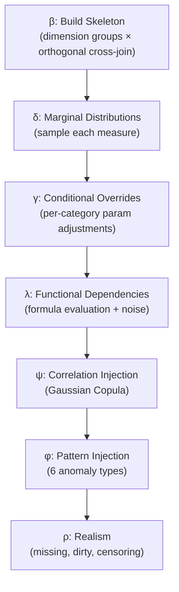

# Subtask 1: FactTableSimulator SDK — Walkthrough

## What Was Built

The type-safe SDK that LLMs program against — the core technical contribution of AGPDS Phase 2. The LLM writes Python scripts calling this API; a deterministic engine produces atomic-grain fact tables.

### New Files

| File | Lines | Purpose |
|------|-------|---------|
| [fact_table_simulator.py](file:///home/dingcheng/projects/chartAgent_copy/chartAgentVAGEN/pipeline/phase_2/fact_table_simulator.py) | 1044 | `FactTableSimulator` class with 9 API methods + 7-stage deterministic `generate()` engine |
| [distributions.py](file:///home/dingcheng/projects/chartAgent_copy/chartAgentVAGEN/pipeline/phase_2/distributions.py) | 173 | Unified `sample_distribution()` interface for 8 distribution families |
| [patterns.py](file:///home/dingcheng/projects/chartAgent_copy/chartAgentVAGEN/pipeline/phase_2/patterns.py) | 304 | `inject_pattern()` dispatcher for 6 narrative-driven statistical anomaly types |
| [schema_metadata.py](file:///home/dingcheng/projects/chartAgent_copy/chartAgentVAGEN/pipeline/phase_2/schema_metadata.py) | 84 | 8 TypedDicts defining the Phase 2 → Phase 3 contract |
| [validators.py](file:///home/dingcheng/projects/chartAgent_copy/chartAgentVAGEN/pipeline/phase_2/validators.py) | 425 | `SchemaAwareValidator` with L1/L2/L3 checks, auto-fix dispatch, `generate_with_validation()` |
| [\_\_init\_\_.py](file:///home/dingcheng/projects/chartAgent_copy/chartAgentVAGEN/pipeline/phase_2/__init__.py) | 23 | Package exports |
| [test_fact_table_simulator.py](file:///home/dingcheng/projects/chartAgent_copy/chartAgentVAGEN/pipeline/phase_2/tests/test_fact_table_simulator.py) | 425 | 9 end-to-end verification tests |

**Total: ~2,478 lines of new code**

---

## Architecture

### SDK API (9 Methods)

The API enforces a two-step ordering discipline — **Step 1** (column declarations) must complete before **Step 2** (relationships & patterns):

**Step 1 — Declare columns:**

| Method | Purpose |
|--------|---------|
| `add_category(name, values, weights, group, parent)` | Categorical column with dimension group assignment and optional hierarchy |
| `add_measure(name, dist, params, scale)` | Numerical column with named distribution (8 families supported) |
| `add_temporal(name, start, end, freq)` | Temporal dimension column |

**Step 2 — Relationships & patterns:**

| Method | Purpose |
|--------|---------|
| `add_conditional(measure, on, mapping)` | Distribution params vary by category: P(measure \| category) |
| `add_dependency(target, formula, noise_sigma)` | Functional dependency: target = f(cols) + noise |
| `add_correlation(col_a, col_b, target_r)` | Pearson correlation via Gaussian Copula |
| `declare_orthogonal(group_a, group_b, rationale)` | Group-level statistical independence |
| `inject_pattern(type, target, col, params)` | Narrative-driven anomaly injection |
| `set_realism(missing_rate, dirty_rate, censoring)` | Data imperfections (missing, dirty, censored) |

### Deterministic Engine (7 Stages)

```
M = τ_post ∘ ρ ∘ φ ∘ ψ ∘ λ ∘ γ ∘ δ ∘ β(seed)
```



### Distribution Families (8)

`gaussian`, `lognormal`, `gamma`, `beta`, `uniform`, `poisson`, `exponential`, `mixture`

Each sampler validates required parameters and rejects degenerate inputs (zero variance, negative scale, etc.).

### Pattern Types (6)

| Pattern | Effect |
|---------|--------|
| `outlier_entity` | Scale filtered entity's values to z_score SDs above mean |
| `trend_break` | Level shift after temporal breakpoint |
| `ranking_reversal` | Highest on metric1 becomes lowest on metric2 |
| `dominance_shift` | Dominant entity switches at temporal midpoint |
| `convergence` | Gap between top-2 entities narrows over time |
| `seasonal_anomaly` | Sinusoidal seasonality inverted for target entity |

### Schema Metadata (Phase 2 → Phase 3 Contract)

8 TypedDicts forming the structured metadata output:

`SchemaMetadata` → `{dimension_groups, orthogonal_groups, columns, conditionals, correlations, dependencies, patterns, total_rows}`

### Three-Layer Validation

| Layer | What It Checks |
|-------|----------------|
| **L1: Structural** | Row count (±10%), cardinality, column existence, orthogonality (χ² test) |
| **L2: Statistical** | Correlation targets (±0.30), dependency residuals, KS distribution test |
| **L3: Pattern** | Outlier z-scores (≥2.0), ranking reversals, trend breaks (≥15% shift) |

Auto-fix dispatch table with strategies: `relax_target_r`, `widen_variance`, `amplify_magnitude`, `reshuffle_pair`.

---

## Test Results

All 9 tests pass (run with `conda activate chart`):

```
✓ Test 1: Hospital example end-to-end — 500 rows × 8 columns
✓ Test 2: Ordering guard — Step 2 before Step 1 correctly raises errors
✓ Test 3: Dimension groups & orthogonality — χ² independence confirmed
✓ Test 4: Hierarchy — parent-child structural consistency
✓ Test 5: Correlation injection — Gaussian Copula within ±0.15 of target
✓ Test 6: Conditional distribution — grouped means correctly ordered
✓ Test 7: Pattern injection — outlier z-score ≥ 2.0
✓ Test 8: Reproducibility — same seed → identical output
✓ Test 9: Three-layer validation — majority of checks pass
```

Run command:
```bash
conda activate chart
cd /home/dingcheng/projects/chartAgent_copy/chartAgentVAGEN/pipeline
python -m phase_2.tests.test_fact_table_simulator
```
