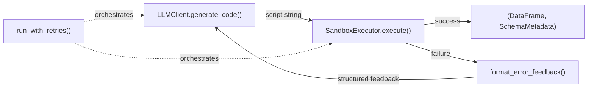

# Subtask 3: Sandbox Executor + Error Feedback Loop — Walkthrough

## What Was Built

A sandboxed Python executor that runs LLM-generated [FactTableSimulator](file:///home/dingcheng/projects/chartAgent_copy/chartAgentVAGEN/pipeline/phase_2/fact_table_simulator.py#21-1035) scripts with error feedback for self-correction.

### New Files

| File | Purpose |
|------|---------|
| [sandbox_executor.py](file:///home/dingcheng/projects/chartAgent_copy/chartAgentVAGEN/pipeline/phase_2/sandbox_executor.py) | [SandboxExecutor](file:///home/dingcheng/projects/chartAgent_copy/chartAgentVAGEN/pipeline/phase_2/sandbox_executor.py#133-324), [ExecutionResult](file:///home/dingcheng/projects/chartAgent_copy/chartAgentVAGEN/pipeline/phase_2/sandbox_executor.py#31-45), [format_error_feedback()](file:///home/dingcheng/projects/chartAgent_copy/chartAgentVAGEN/pipeline/phase_2/sandbox_executor.py#330-363), [run_with_retries()](file:///home/dingcheng/projects/chartAgent_copy/chartAgentVAGEN/pipeline/phase_2/sandbox_executor.py#417-489), `PHASE2_SYSTEM_PROMPT` |
| [test_sandbox_executor.py](file:///home/dingcheng/projects/chartAgent_copy/chartAgentVAGEN/pipeline/phase_2/tests/test_sandbox_executor.py) | 9 test cases covering all execution paths |

### Modified Files

| File | Change |
|------|--------|
| [\_\_init\_\_.py](file:///home/dingcheng/projects/chartAgent_copy/chartAgentVAGEN/pipeline/phase_2/__init__.py) | Added [SandboxExecutor](file:///home/dingcheng/projects/chartAgent_copy/chartAgentVAGEN/pipeline/phase_2/sandbox_executor.py#133-324), [ExecutionResult](file:///home/dingcheng/projects/chartAgent_copy/chartAgentVAGEN/pipeline/phase_2/sandbox_executor.py#31-45), [run_with_retries](file:///home/dingcheng/projects/chartAgent_copy/chartAgentVAGEN/pipeline/phase_2/sandbox_executor.py#417-489) exports |

## Architecture



**Security model:** Restricted `__builtins__` (no `os`, `sys`, `open`, [exec](file:///home/dingcheng/projects/chartAgent_copy/chartAgentVAGEN/pipeline/phase_2/sandbox_executor.py#180-324), `__import__`), whitelisted libraries only ([FactTableSimulator](file:///home/dingcheng/projects/chartAgent_copy/chartAgentVAGEN/pipeline/phase_2/fact_table_simulator.py#21-1035), `numpy`, `pandas`, `math`, `datetime`), 30-second SIGALRM timeout.

## Test Results

All 9 tests passed (run with `conda activate chart`):

```
✓ Test 1: Valid script execution — 100 rows, 4 columns
✓ Test 2: SyntaxError capture
✓ Test 3: SDK ValueError capture
✓ Test 4: Blocked imports (import os → ImportError)
✓ Test 5: Blocked builtins (open → NameError, exec → NameError)
✓ Test 6: Timeout enforcement (2s infinite loop → TimeoutError)
✓ Test 7: Error feedback formatting (307 chars, parseable)
✓ Test 8: Seed propagation (same seed → identical output)
✓ Test 9: Missing build_fact_table → NameError
```

Run command:
```bash
conda activate chart
cd /home/dingcheng/projects/chartAgent_copy/chartAgentVAGEN/pipeline
python -m phase_2.tests.test_sandbox_executor
```
