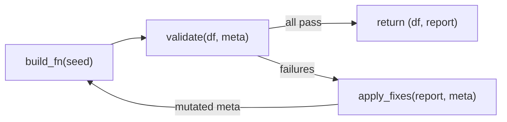

# Subtask 4: Three-Layer Validation + Auto-Fix — Walkthrough

## What Changed

Filled 5 gaps in the existing [validators.py](file:///home/dingcheng/projects/chartAgent_copy/chartAgentVAGEN/pipeline/phase_2/validators.py) (425 → 606 lines). No rewrites — all existing validation logic preserved.

### Modified Files

| File | Changes |
|------|---------|
| [validators.py](file:///home/dingcheng/projects/chartAgent_copy/chartAgentVAGEN/pipeline/phase_2/validators.py) | 4 gaps filled: real auto-fix, L3 patterns, KS expansion, parameter mutation |
| [\_\_init\_\_.py](file:///home/dingcheng/projects/chartAgent_copy/chartAgentVAGEN/pipeline/phase_2/__init__.py) | Added [FixAction](file:///home/dingcheng/projects/chartAgent_copy/chartAgentVAGEN/pipeline/phase_2/validators.py#480-488), [apply_fixes](file:///home/dingcheng/projects/chartAgent_copy/chartAgentVAGEN/pipeline/phase_2/validators.py#617-634) exports |

### New Files

| File | Purpose |
|------|---------|
| [test_validators.py](file:///home/dingcheng/projects/chartAgent_copy/chartAgentVAGEN/pipeline/phase_2/tests/test_validators.py) | 8 test cases covering all gaps + regression |

---

## Gaps Filled

### Gap 1: Real Auto-Fix Functions

Placeholder stubs replaced with [FixAction](file:///home/dingcheng/projects/chartAgent_copy/chartAgentVAGEN/pipeline/phase_2/validators.py#480-488)-returning functions that **actually mutate [SchemaMetadata](file:///home/dingcheng/projects/chartAgent_copy/chartAgentVAGEN/pipeline/phase_2/schema_metadata.py#69-84)**:

| Function | Mutation |
|----------|---------|
| [_relax_target_r](file:///home/dingcheng/projects/chartAgent_copy/chartAgentVAGEN/pipeline/phase_2/validators.py#490-515) | `correlations[i].target_r` moved toward 0 by step=0.05 |
| [_widen_variance](file:///home/dingcheng/projects/chartAgent_copy/chartAgentVAGEN/pipeline/phase_2/validators.py#359-362) | `columns[name].sigma/scale` multiplied by factor=1.2 |
| [_amplify_magnitude](file:///home/dingcheng/projects/chartAgent_copy/chartAgentVAGEN/pipeline/phase_2/validators.py#541-584) | Pattern `z_score/magnitude/amplitude` multiplied by factor=1.3 |
| [_reshuffle_pair](file:///home/dingcheng/projects/chartAgent_copy/chartAgentVAGEN/pipeline/phase_2/validators.py#586-594) | Flags seed increment (orthogonal re-shuffle) |

### Gap 2: L3 Validation for 3 Missing Patterns

| Pattern | Check Logic |
|---------|------------|
| [dominance_shift](file:///home/dingcheng/projects/chartAgent_copy/chartAgentVAGEN/pipeline/phase_2/patterns.py#184-221) | Dominant entity on [col](file:///home/dingcheng/projects/chartAgent_copy/chartAgentVAGEN/pipeline/phase_2/validators.py#416-423) changes across temporal midpoint |
| [convergence](file:///home/dingcheng/projects/chartAgent_copy/chartAgentVAGEN/pipeline/phase_2/patterns.py#223-258) | Gap between top-2 entity means shrinks ≥10% over time |
| [seasonal_anomaly](file:///home/dingcheng/projects/chartAgent_copy/chartAgentVAGEN/pipeline/phase_2/patterns.py#260-294) | Target entity's seasonal correlation differs from overall |

### Gap 3: KS Test Extended to 6 Distributions

New [_get_ks_args()](file:///home/dingcheng/projects/chartAgent_copy/chartAgentVAGEN/pipeline/phase_2/validators.py#439-474) dispatcher maps SDK distributions to scipy.stats:

[gaussian](file:///home/dingcheng/projects/chartAgent_copy/chartAgentVAGEN/pipeline/phase_2/distributions.py#87-91) → [norm](file:///home/dingcheng/projects/chartAgent_copy/chartAgentVAGEN/pipeline/phase_2/distributions.py#93-97) · [lognormal](file:///home/dingcheng/projects/chartAgent_copy/chartAgentVAGEN/pipeline/phase_2/distributions.py#93-97) → [lognorm](file:///home/dingcheng/projects/chartAgent_copy/chartAgentVAGEN/pipeline/phase_2/distributions.py#93-97) · [gamma](file:///home/dingcheng/projects/chartAgent_copy/chartAgentVAGEN/pipeline/phase_2/distributions.py#99-103) → [gamma](file:///home/dingcheng/projects/chartAgent_copy/chartAgentVAGEN/pipeline/phase_2/distributions.py#99-103) · [beta](file:///home/dingcheng/projects/chartAgent_copy/chartAgentVAGEN/pipeline/phase_2/distributions.py#105-109) → [beta](file:///home/dingcheng/projects/chartAgent_copy/chartAgentVAGEN/pipeline/phase_2/distributions.py#105-109) · [uniform](file:///home/dingcheng/projects/chartAgent_copy/chartAgentVAGEN/pipeline/phase_2/distributions.py#111-119) → [uniform](file:///home/dingcheng/projects/chartAgent_copy/chartAgentVAGEN/pipeline/phase_2/distributions.py#111-119) · [exponential](file:///home/dingcheng/projects/chartAgent_copy/chartAgentVAGEN/pipeline/phase_2/distributions.py#127-131) → [expon](file:///home/dingcheng/projects/chartAgent_copy/chartAgentVAGEN/pipeline/phase_2/distributions.py#127-131)

### Gap 4: [generate_with_validation()](file:///home/dingcheng/projects/chartAgent_copy/chartAgentVAGEN/pipeline/phase_2/validators.py#392-425) Parameter Mutation



The loop now: runs [apply_fixes()](file:///home/dingcheng/projects/chartAgent_copy/chartAgentVAGEN/pipeline/phase_2/validators.py#617-634) → saves mutated meta as overrides → increments seed → retries with adjusted parameters.

---

## Test Results

### New validator tests (8/8 pass):
```
✓ Test 1: L3 dominance_shift pattern detection
✓ Test 2: L3 convergence pattern detection
✓ Test 3: L3 seasonal_anomaly pattern detection
✓ Test 4: KS test for 6 distributions + None for poisson/mixture
✓ Test 5: _relax_target_r mutates meta (-0.55 → -0.50)
✓ Test 6: _amplify_magnitude mutates meta (3.0 → 3.9)
✓ Test 7: generate_with_validation() completes with auto-fix
✓ Test 8: Regression — hospital example at 82%
```

### Regression (all green):
```
✓ test_fact_table_simulator: 9/9 pass
✓ test_sandbox_executor: 9/9 pass
✓ test_validators: 8/8 pass
```

Run command:
```bash
conda activate chart
cd /home/dingcheng/projects/chartAgent_copy/chartAgentVAGEN/pipeline
python -m phase_2.tests.test_validators
python -m phase_2.tests.test_fact_table_simulator
python -m phase_2.tests.test_sandbox_executor
```
