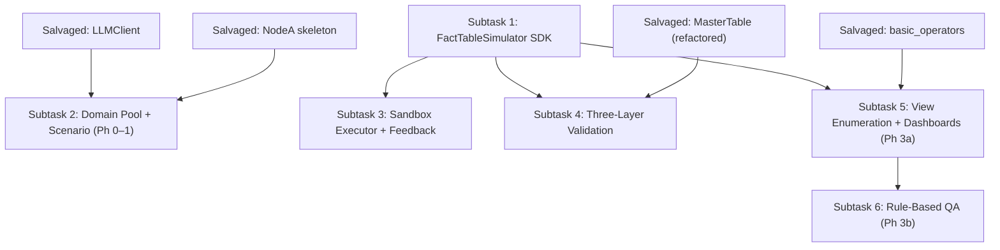

# AGPDS Salvage Audit & Implementation Roadmap

## Phase 1: Reusable Components

| Priority | Component | Current Function | Maps To (Framework Module) | Refactoring Needed |
|----------|-----------|-----------------|---------------------------|-------------------|
| 1 | [LLMClient](file:///home/dingcheng/projects/chartAgent_copy/chartAgentVAGEN/pipeline/generation_pipeline.py#L1856-L2053) + [ParameterAdapter](file:///home/dingcheng/projects/chartAgent_copy/chartAgentVAGEN/pipeline/generation_pipeline.py#L1790-L1849) | Multi-provider LLM client (OpenAI, Gemini-native, Azure, custom) with auto-detection, parameter adaptation, JSON parsing, and markdown fence stripping | **AGPDS Core Infrastructure** — used by Phase 0 (domain generation), Phase 1 (scenario contextualization), and Phase 2 (SDK code generation) | **Minimal.** Extract from the monolithic `generation_pipeline.py` into a standalone `core/llm_client.py` module. Add a `generate_code()` convenience method (sets `response_format="text"` and wraps output in ````python` fence stripping) for Phase 2's code-generation role. No logic changes needed. |
| 2 | [basic_operators.py](file:///home/dingcheng/projects/chartAgent_copy/chartAgentVAGEN/pipeline/adapters/basic_operators.py) | 6 relational operators (`Filter`, `Project`, `GroupBy`, `Aggregate`, `Sort`, `Limit`) + `Chain` combinator, all operating on `pd.DataFrame` | **AGPDS Phase 3 — View Extraction Engine.** These operators implement the Set operators (σ, π, γ, τ, λ) specified in the Operator Algebra. | **Moderate.** (1) Add missing operators: `ValueAt` (Ψ — positional lookup), `Ratio`/`Diff` (Δ — arithmetic), `ArgMax`/`ArgMin`. (2) Add `Slice` (top-k / bottom-k shortcut). (3) Add an `__init__.py` re-export. Logic of existing operators is correct and tested — do **not** rewrite. |
| 3 | [MasterTable](file:///home/dingcheng/projects/chartAgent_copy/chartAgentVAGEN/pipeline/schemas/master_table.py) | Dataclass wrapping a `pd.DataFrame` + metadata dict; provides `from_csv()`, `to_csv()`, and `validate_schema()` (Star Schema checks) | **AGPDS Phase 2 output contract** — the Master Fact Table artifact passed from Phase 2 → Phase 3 | **Moderate.** (1) Replace `metadata: dict` with a typed `SchemaMetadata` dataclass (dimension_groups, orthogonal_groups, correlations, patterns). (2) Strengthen `validate_schema()` to check dimension group cardinality and orthogonality (χ² test). (3) Remove `to_legacy_chart_entry()` — this adapter logic belongs in the View Extraction Engine, not on the data container. |
| 4 | [NodeA_TopicAgent](file:///home/dingcheng/projects/chartAgent_copy/chartAgentVAGEN/pipeline/generation_pipeline.py#L626-L799) | LLM-based topic generation within a user-specified category; diversity tracker; prompt construction; output validation | **AGPDS Phase 1 — Scenario Contextualization** | **Moderate-to-heavy.** The *architecture* (prompt builder + diversity tracker + output validator + state updater) is reusable. The *content* needs rewriting: (1) Input must change from flat `category_id` to structured Domain Pool sample (from Phase 0). (2) Output schema must change to AGPDS format: `scenario_title`, `data_context`, `key_entities`, `key_metrics`, `temporal_granularity`, `target_rows`. (3) `validate_output()` substring dedup should be replaced with embedding-based cosine similarity. (4) Prompt text (`PROMPT_NODE_A_TOPIC_AGENT`) must be rewritten to match `phase_1.md` §1.2. The class skeleton and plumbing (LLM call, retry, state mutation) remain as-is. |
| 5 | [ChartAgentPipelineRunner](file:///home/dingcheng/projects/chartAgent_copy/chartAgentVAGEN/pipeline/generation_runner.py#L169-L359) | Orchestrator with `run_single()`, `run_batch()`, `save_results()`; per-node timing, real-time logging, CSV export alongside JSON | **AGPDS Pipeline Orchestrator** — coordinates the 4-phase workflow | **Heavy.** The runner's shape (single/batch execution, logging, save logic) is reusable, but the wiring must change: (1) Insert Phase 0 bootstrap (idempotent domain-pool load). (2) Replace Node A→B→C→D calls with Phase 0→1→2→3 calls. (3) Extend `save_results()` to persist QA pairs, view specs, and dashboard metadata alongside chart images and CSVs. (4) Add `seed` propagation for reproducibility. The orchestration pattern itself is proven and should **not** be redesigned from scratch. |

### Components That Cannot Be Cleanly Reused

| Component | Current Location | Reason for Non-Reuse |
|-----------|-----------------|---------------------|
| `NodeB_DataFabricator` | [generation_pipeline.py#L802–913](file:///home/dingcheng/projects/chartAgent_copy/chartAgentVAGEN/pipeline/generation_pipeline.py#L802-L913) | Implements the **LLM-as-Data-Generator** anti-pattern — prompts the LLM to produce raw CSV. AGPDS requires LLM-as-Data-Programmer (SDK code generation). The prompt, parsing, and validation are all CSV-centric. **Replace entirely** with a new `AgenticDataSimulator` that prompts for SDK scripts, executes them in a sandbox, and runs three-layer validation. |
| `NodeC_SchemaMapper._adapter_*` methods | [generation_pipeline.py#L1261–1460](file:///home/dingcheng/projects/chartAgent_copy/chartAgentVAGEN/pipeline/generation_pipeline.py#L1261-L1460) | These 6 per-chart adapters hard-code column-picking heuristics (`_pick_columns`) and chart-specific key names (`bar_data`, `scatter_x_data`). AGPDS replaces this with a data-driven `ViewEnumerator` that uses `VIEW_EXTRACTION_RULES` and `SchemaMetadata` for column binding. The adapter code is **tightly coupled** to the legacy chart schema format and cannot be incrementally refactored. |
| `PROMPT_NODE_B_DATA_FABRICATOR` | [generation_pipeline.py#L322–391](file:///home/dingcheng/projects/chartAgent_copy/chartAgentVAGEN/pipeline/generation_pipeline.py#L322-L391) | Prompt asks LLM to produce CSV. Must be replaced with the SDK code-generation prompt. |
| `PROMPT_NODE_D_RL_CAPTIONER` | [generation_pipeline.py#L559–619](file:///home/dingcheng/projects/chartAgent_copy/chartAgentVAGEN/pipeline/generation_pipeline.py#L559-L619) | Generates captions via LLM. AGPDS Phase 3 is entirely deterministic — QA pairs are generated by templates and pattern detection, not LLM. |
| `MasterDataRecord` | [generation_pipeline.py#L172–185](file:///home/dingcheng/projects/chartAgent_copy/chartAgentVAGEN/pipeline/generation_pipeline.py#L172-L185) | Flat record (entities, primary/secondary/tertiary values) reflecting aggregated grain. AGPDS data is atomic-grain DataFrames. **Delete.** |

---

## Phase 2: Implementation Subtasks

### Subtask 1: FactTableSimulator SDK

- **Objective:** Build the type-safe SDK that LLMs will program against — the core technical contribution of AGPDS.
- **Inputs:** AGPDS spec (`phase_2.md` §2.1) → **Outputs:** `pipeline/phase_2/fact_table_simulator.py` with all 9 API methods + deterministic `generate()` engine
- **Depends on:** Nothing (leaf node — start here)
- **Key decisions:**
  - Column storage model: register declarations in-order, build DataFrame at `generate()` time
  - Correlation engine: Cholesky decomposition for multi-target correlation (`add_correlation`)
  - Pattern injection: post-hoc mutation of specific rows/entities (`inject_pattern`)
  - Orthogonality enforcement: Cartesian product of group levels, optionally pruned

> [!IMPORTANT]
> This is the **critical-path item**. Subtasks 2, 3, and 4 all depend on the SDK being functional.

---

### Subtask 2: Domain Pool + Scenario Contextualization (Phases 0–1)

- **Objective:** Replace the flat `META_CATEGORIES` list with a cached, two-level domain taxonomy and a structured scenario generation prompt.
- **Inputs:** AGPDS spec (`phase_0.md`, `phase_1.md`) + salvaged `LLMClient` + salvaged `NodeA_TopicAgent` skeleton → **Outputs:** `pipeline/phase_0/domain_pool.py`, `pipeline/phase_1/scenario_contextualizer.py`, cached domain pool JSON artifact
- **Depends on:** Salvaged `LLMClient` (Priority 1 component)
- **Reuse note:** The `NodeA_TopicAgent` class skeleton (prompt builder + diversity tracker + validator + state updater) is refactored into `ScenarioContextualizer`, keeping the orchestration logic but replacing prompt content, output schema, and deduplication method.

---

### Subtask 3: Sandbox Executor + Error Feedback Loop

- **Objective:** Create a sandboxed Python executor that runs LLM-generated `FactTableSimulator` scripts, captures exceptions, and routes tracebacks back for LLM self-correction (max 3 retries).
- **Inputs:** LLM-generated Python script string + `FactTableSimulator` SDK → **Outputs:** `pipeline/phase_2/sandbox_executor.py` producing either a `MasterTable` + `SchemaMetadata` on success, or structured error feedback on failure
- **Depends on:** Subtask 1 (FactTableSimulator SDK)
- **Existing code risk:** The current `NodeB_DataFabricator.__call__` has a basic retry loop for LLM calls but no sandbox execution. This logic **cannot** be reused — it retries the *prompt*, not a *script execution*. Build from scratch using `exec()` with restricted globals or `subprocess` isolation.

---

### Subtask 4: Three-Layer Validation + Auto-Fix

- **Objective:** Implement the structural, statistical, and pattern validation layers that verify `FactTableSimulator` output, with deterministic auto-fix when possible.
- **Inputs:** `MasterTable` + `SchemaMetadata` from Subtask 1/3 → **Outputs:** `pipeline/phase_2/validators.py` with `L1_structural()`, `L2_statistical()`, `L3_pattern()` methods; auto-fix mutations
- **Depends on:** Subtask 1 (SDK defines the schema metadata contract)
- **Reuse note:** The existing `MasterTable.validate_schema()` performs L1-style structural checks (temporal backbone, categorical diversity, numeric count). Its logic can be **absorbed** into `L1_structural()` and extended with dimension-group cardinality checks and orthogonality χ² tests.

---

### Subtask 5: View Enumeration + Dashboard Composition (Phase 3a)

- **Objective:** Build the deterministic View Extraction Engine that projects the Master Table into chart-ready DataFrames and composes multi-chart dashboards.
- **Inputs:** `MasterTable` + `SchemaMetadata` + `CHART_TYPE_REGISTRY` → **Outputs:** `pipeline/phase_3/view_enumerator.py`, `pipeline/phase_3/dashboard_composer.py`; list of scored `ViewSpec` objects and `Dashboard` objects
- **Depends on:** Subtask 1 (schema metadata structure), salvaged `basic_operators.py` (Priority 2 component)
- **Reuse note:** The salvaged relational operators (`Filter`, `Project`, `GroupBy`, `Sort`, `Limit`, `Chain`) become the execution engine for `VIEW_EXTRACTION_RULES`. The `_adapter_*` methods on `NodeC_SchemaMapper` contain useful *algorithmic intent* (e.g., "pivot entity × temporal for line charts") that can inform the rule definitions, even though the code itself is not reused.

---

### Subtask 6: Rule-Based QA Generation (Phase 3b)

- **Objective:** Build the template-based QA generator producing intra-view, inter-view, and pattern-triggered questions with difficulty tiering.
- **Inputs:** `ViewSpec` list + `Dashboard` list + pattern metadata → **Outputs:** `pipeline/phase_3/qa_generator.py`; list of `QAPair` objects with question, answer, reasoning chain, and difficulty
- **Depends on:** Subtask 5 (view specs and dashboards define the QA scope)
- **Existing code risk:** `PROMPT_NODE_D_RL_CAPTIONER` generates captions via LLM. This is the opposite of what AGPDS requires (rule-based, no LLM). **No code reuse possible** — this subtask is entirely greenfield.

---

## Dependency Graph



**Recommended execution order:** S1 → S3 → S4 → S2 (parallelizable with S3/S4) → S5 → S6

---

## Integration Note

The five salvaged components form a **U-shaped** integration pattern: `LLMClient` (infra) and `NodeA skeleton` (Phase 1) plug into the front of the pipeline, while `basic_operators` (Phase 3) and `MasterTable` (cross-phase data contract) plug into the back. The critical middle — `FactTableSimulator` SDK, sandbox executor, and three-layer validation — is entirely new construction. The `ChartAgentPipelineRunner` sits above everything as the orchestration shell: its `run_single()`/`run_batch()`/`save_results()` patterns remain valid but must be rewired to call Phase 0→1→2→3 instead of Node A→B→C→D. This means the pipeline can be built **incrementally**: implement Subtask 1 (SDK), verify it in isolation, then swap out Node B while keeping the rest of the runner functional, gradually replacing each node until the full AGPDS pipeline is operational.
