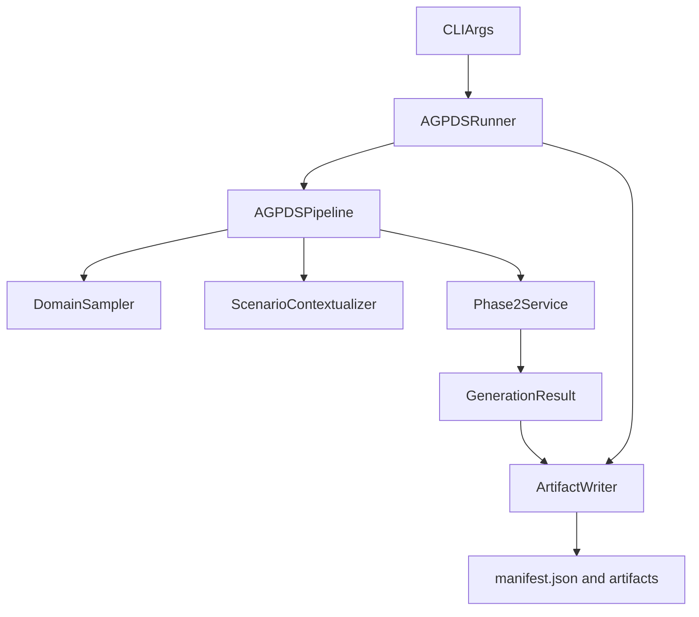

# AGPDS Pipeline/Runner 重设计草案（推荐方案 v1）

## 背景与设计目标

当前 `AGPDS` 主流程可运行，但 `orchestrator` 与 `runner` 的职责边界偏厚，主要表现为：

- `pipeline/agpds_pipeline.py` 同时承担编排、重试补丁包装、日志输出、磁盘落盘前置步骤。
- `pipeline/agpds_runner.py` 同时承担 CLI、批处理、工件目录策略和数据序列化。
- `pipeline/core/master_table.py` 在主链路中仅作为弱校验副作用，不是严格契约。

本草案目标是将主流程重构为：

- **薄 orchestrator**：`agpds_pipeline.py`
- **薄 runner**：`agpds_runner.py`
- **抽离工件输出层**：`artifact_writer.py`（等价替代拆分）
- **显式结果模型**：`result_models.py`（或同等模型文件）

## 非目标

- 不重写 `pipeline/phase_2/*` 的算法细节（采样、验证器、sandbox 语义）。
- 不修改 `pipeline/core/llm_client.py` 的 provider 适配策略。
- 不在本阶段删除 legacy 文件，仅调整主路径依赖方向。

## 当前问题归纳（重写动机）

### `agpds_pipeline.py` 的混杂职责

- 同时做 Phase 0/1/2 编排与 `meta_override` 脚本包装。
- 同时负责 scenario 文件落盘和流程日志打印。
- 返回值为 IO 友好的大字典（内嵌 `master_data_csv`），不利于复用。
- 在主路径实例化 `MasterTable`，但未以其结果作为严格 gate。

### `agpds_runner.py` 的混杂职责

- CLI 参数解析 + 模型初始化 + 批处理调度 + 工件写盘全部耦合。
- `save_results()` 直接操作多目录、多格式，导致 runner 难以替换。
- 输出结构被存储格式反向驱动，不利于 pipeline API 稳定化。

## 推荐架构总览

## 文件级设计：`pipeline/agpds_pipeline.py`

### 1) 职责

- 串联 Phase 0/1/2 执行顺序。
- 将各阶段结果组装为类型化 `GenerationResult`。
- 统一业务级异常包装（不处理 CLI exit 语义）。
- 不负责任何磁盘写入和目录策略。

### 2) 公开类

#### `class AGPDSPipeline`

构造依赖：

- `llm_client: LLMClient`
- `domain_sampler: DomainSampler | None = None`
- `contextualizer: ScenarioContextualizer | None = None`
- `phase2_service: Phase2Service | None = None`

> 说明：允许依赖注入，便于单元测试替换 mock。

### 3) 方法草案（签名/返回类型）

| 方法 | 输入 | 返回类型 | 说明 |
|---|---|---|---|
| `__init__(...)` | 如上依赖 | `None` | 依赖装配；不做重 IO 操作 |
| `run_single(request)` | `GenerationRequest` | `GenerationResult` | 单次完整编排入口 |
| `run_batch(requests, continue_on_error=True)` | `list[GenerationRequest]` | `list[GenerationResult]` | 批量执行；逐条隔离错误 |
| `_resolve_category_topic(category_id)` | `int` | `str | None` | 仅用于 topic filter，不参与语义建模 |
| `_run_phase0(request)` | `GenerationRequest` | `dict` | 产出 `domain_context` |
| `_run_phase1(domain_context)` | `dict` | `ScenarioContext` | 调 contextualizer |
| `_run_phase2(scenario, request)` | `ScenarioContext, GenerationRequest` | `Phase2Output` | 调 phase2 service，返回 df/meta/report/script |
| `_build_result(...)` | 分阶段产物 | `GenerationResult` | 聚合成统一结果对象 |

### 4) 建议返回模型（主路径不再返回 `master_data_csv`）

- `GenerationResult.dataframe: pd.DataFrame`
- `GenerationResult.schema_metadata: dict[str, Any]`
- `GenerationResult.validation_report: ValidationReport | dict`
- `GenerationResult.phase2_script: str | None`
- `GenerationResult.scenario: ScenarioContext`
- `GenerationResult.domain_context: dict[str, Any]`
- `GenerationResult.generation_id: str`
- `GenerationResult.status: Literal["success", "soft_failed", "failed"]`
- `GenerationResult.error: PipelineErrorInfo | None`

### 5) 明确不负责事项

- 不写 `csv/json/log` 文件。
- 不拼接 `charts.json`。
- 不处理 `sys.exit`。
- 不实例化 `MasterTable`。

## 文件级设计：`pipeline/agpds_runner.py`

### 1) 职责

- CLI 参数解析与默认值决策（env/flag 优先级）。
- 初始化 `LLMClient` 和 `AGPDSPipeline`。
- 将 `GenerationResult` 委托给 `ArtifactWriter` 输出。
- 负责进程级返回码策略。

### 2) 公开类

#### `class AGPDSRunner`

构造依赖：

- `pipeline: AGPDSPipeline`
- `artifact_writer: ArtifactWriter`
- `verbose: bool = True`

### 3) 方法草案（签名/返回类型）

| 方法 | 输入 | 返回类型 | 说明 |
|---|---|---|---|
| `run_single(request)` | `GenerationRequest` | `GenerationResult` | 透传调用 pipeline |
| `run_batch(requests, continue_on_error=True)` | `list[GenerationRequest]` | `list[GenerationResult]` | 批量执行 |
| `persist_results(results, output_dir)` | `list[GenerationResult], str` | `ArtifactManifest` | 统一写盘入口 |
| `_log(msg)` | `str` | `None` | 日志输出适配 |
| `build_requests_from_args(args)` | `argparse.Namespace` | `list[GenerationRequest]` | 参数到请求对象映射 |

### 4) 模块级函数草案

| 函数 | 输入 | 返回类型 | 说明 |
|---|---|---|---|
| `parse_args(argv=None)` | `list[str] | None` | `argparse.Namespace` | CLI 参数定义 |
| `resolve_api_key(args)` | `Namespace` | `str` | provider 与环境变量路由 |
| `resolve_model(args)` | `Namespace` | `str` | 模型优先级决策 |
| `build_llm_client(args)` | `Namespace` | `LLMClient` | 装配 core LLM client |
| `main(argv=None)` | `list[str] | None` | `int` | 进程主入口，返回 exit code |

### 5) 明确不负责事项

- 不含 Phase 业务逻辑。
- 不直接接触 DataFrame 内部字段。
- 不内置 artifact 布局规则（交由 writer）。

## 推荐等价拆分文件（新增）

### A. `pipeline/agpds/result_models.py`

建议定义：

- `@dataclass class GenerationRequest`
- `@dataclass class ScenarioContext`
- `@dataclass class Phase2Output`
- `@dataclass class PipelineErrorInfo`
- `@dataclass class GenerationResult`
- `@dataclass class ArtifactManifest`
- `@dataclass class ArtifactPaths`

目标：

- 替代松散 `dict` 约定。
- 明确方法签名和类型边界。

### B. `pipeline/agpds/artifact_writer.py`

建议定义：

#### `class ArtifactWriter`

| 方法 | 输入 | 返回类型 | 说明 |
|---|---|---|---|
| `write_result(result, output_dir)` | `GenerationResult, str` | `ArtifactPaths` | 单条结果写盘 |
| `write_batch(results, output_dir)` | `list[GenerationResult], str` | `ArtifactManifest` | 批量写盘 |
| `_write_dataframe_csv(df, path)` | `pd.DataFrame, str` | `str` | 仅 CSV 持久化 |
| `_write_schema(meta, path)` | `dict, str` | `str` | schema metadata |
| `_write_scenario(scenario, path)` | `dict, str` | `str` | 场景快照 |
| `_write_validation(report, path)` | `dict | object, str` | `str` | 校验报告 |
| `_write_script(script, path)` | `str | None, str` | `str | None` | 保存生成脚本 |
| `_write_manifest(manifest, path)` | `ArtifactManifest, str` | `str` | 汇总索引 |

## `MasterTable` 去留建议

### 结论

- **从新主路径移除**：不再作为 pipeline 运行 gate。
- **短期保留**：作为 legacy adapter / 临时 smoke checker。
- **中期处理**：如果 Phase 3 不再依赖其 legacy 转换，再统一删除或迁移到 `pipeline/legacy/`。

### 原因

- 现有 `MasterTable.validate_schema()` 以 warning 为主，语义弱于 Phase 2 三层 validator。
- 在当前主流程中仅有副作用调用，不参与严格结果裁决。

## 迁移步骤与兼容策略

### Step 1：引入新模型与 writer（不破坏旧入口）

- 新增 `result_models.py` 与 `artifact_writer.py`。
- `agpds_pipeline.py` 内先双写返回：`GenerationResult` + 兼容字典（过渡期）。

### Step 2：瘦身 `agpds_pipeline.py`

- 去除 scenario 落盘与 `MasterTable` 调用。
- `run_single()` 返回 `GenerationResult`。

### Step 3：瘦身 `agpds_runner.py`

- 去除 `save_results()` 的细节实现。
- 改为 `ArtifactWriter.write_batch()`。

### Step 4：清理兼容层

- 废弃兼容字典返回。
- 将 legacy 输出适配逻辑统一迁出 runner/pipeline。

## 新旧接口映射（关键）

| 旧接口/行为 | 新接口/行为 | 迁移说明 |
|---|---|---|
| `AGPDSPipeline.run_single(...) -> dict` | `AGPDSPipeline.run_single(...) -> GenerationResult` | 字典字段转为类型化对象属性 |
| 返回中内嵌 `master_data_csv` | 返回 `dataframe: pd.DataFrame` | CSV 由 `ArtifactWriter` 决定是否写入 |
| `AGPDSRunner.save_results(...)` | `ArtifactWriter.write_batch(...)` | IO 逻辑抽离，runner 仅调用 |
| pipeline 中 `MasterTable(df, meta)` | 无该步骤 | 如需 smoke check，单独可选 hook |
| runner 直接写 `charts.json` | writer 产出 `manifest.json` + 分工件文件 | 减少单文件膨胀 |

## 验收标准

- 文档内明确列出 `AGPDSPipeline`、`AGPDSRunner`、`GenerationResult`、`ArtifactWriter` 的职责与方法签名。
- 每个公开方法有输入/输出类型，不再只描述行为。
- 文档明确说明 `MasterTable` 不在新主路径上及其迁移定位。
- 文档给出新旧接口映射与最小迁移步骤，能直接指导后续实现。

---

## 附：推荐最小落地顺序（实现时）

1. 先新增 `result_models.py`（零行为，低风险）。
2. 再新增 `artifact_writer.py` 并单测 writer。
3. 然后重构 `agpds_pipeline.py` 返回 `GenerationResult`。
4. 最后重构 `agpds_runner.py`，替换旧 `save_results()`。

