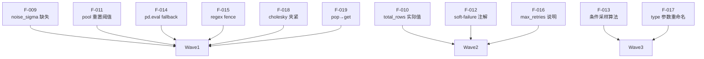

# F-009–F-019 波次修复计划

**来源**: AGPDS Implementation Audit — `audit/04_final_report.md`
**范围**: Issues F-009 至 F-019（P2/P3 优先级）。F-020 明确不在范围内。
**执行状态**: 全部完成 ✓（含事后 spec 对齐）

---

## 依赖关系分析



Wave 2 等待 Wave 1 完成（F-010 改签名后需验证 F-009 的相邻代码未受影响）。
Wave 3 是复杂重构，完全独立于 Wave 1/2，但风险最高，单独执行。

---

## Wave 1 — 机械单行修复（低风险，可并行）

### F-009 · 补充 `noise_sigma` 字段 ⚠️ 后被 spec 对齐回滚

- **根本原因**: schema 输出的 `dependencies` 列表丢弃了 `noise_sigma`
- **文件**: `pipeline/phase_2/fact_table_simulator.py` 行 987–989
- **修复动作**: inject — 在列表推导式中添加 `"noise_sigma": d["noise_sigma"]`
- **风险**: Low
- **最终状态**: 后经 spec §2.3 对比，spec 示例中 `dependencies` 不含 `noise_sigma`，已回滚

---

### F-011 · Pool 重置阈值改为 80% ✓

- **根本原因**: `if len(candidates) < n` 在 100% 耗尽时才重置，违背 spec §0.4 的 80% 阈值，且与注释不符
- **文件**: `pipeline/phase_0/domain_pool.py` 行 388–396
- **修复动作**: replace 条件表达式
- **风险**: Low

修改前:
```python
# Reset at 80% exhaustion
if len(candidates) < n:
    self.used_ids.clear()
    candidates = self.pool
```

修改后:
```python
# Reset at 80% exhaustion of the overall pool, or as a fallback when
# filtered candidates are insufficient to satisfy the request.
total_pool_size = len(self.pool)
if len(self.used_ids) >= 0.8 * total_pool_size or len(candidates) < n:
    self.used_ids.clear()
    candidates = self.pool
```

保留原来的 `or len(candidates) < n` 兜底，防止过滤后候选仍不足的边缘情况。

---

### F-014 · `pd.eval()` fallback 包裹异常上下文 ✓

- **根本原因**: fallback 失败时没有 formula/target 上下文，难以调试
- **文件**: `pipeline/phase_2/fact_table_simulator.py` 行 753–762
- **修复动作**: inject try/except 包裹 fallback
- **风险**: Low

修改前:
```python
except Exception:
    local_vars = {col: df[col] for col in df.columns}
    local_vars.update(eval_context)
    predicted = pd.eval(formula, local_dict=local_vars)
```

修改后:
```python
except Exception:
    local_vars = {col: df[col] for col in df.columns}
    local_vars.update(eval_context)
    try:
        predicted = pd.eval(formula, local_dict=local_vars)
    except Exception as e2:
        raise ValueError(
            f"Dependency formula '{formula}' for '{target}' failed: {e2}"
        ) from e2
```

---

### F-015 · 修正 code-fence 正则，不强制换行 ✓

- **根本原因**: 原正则末尾要求 `\n`，无换行的 fence 不被剥离，导致 `SyntaxError`
- **文件**: `pipeline/core/llm_client.py` 行 387–389
- **修复动作**: replace — 删除正则末尾的 `\n` 要求
- **风险**: Low

修改前:
```python
cleaned = re.sub(r"^```(?:python)?\s*\n", "", cleaned, count=1)
```

修改后:
```python
cleaned = re.sub(r"^```(?:python)?[ \t]*\n?", "", cleaned, count=1)
```

使用 `[ \t]*` 而非 `\s*` 是为了精确限定横向空白，避免意外吸收竖向空白（换行）导致首行代码被误删。

---

### F-018 · 夹紧 `target_r` 防止 Cholesky LinAlgError ✓

- **根本原因**: `target_r = ±1.0` 时相关矩阵 PSD 但非 PD，`np.linalg.cholesky` 抛出 `LinAlgError`；而验证层允许此值，上下游约束不一致
- **文件**: `pipeline/phase_2/fact_table_simulator.py` — `_inject_correlations` 行 825–826
- **修复动作**: inject 一行夹紧
- **风险**: Low

修改后:
```python
# Clamp to open interval: Cholesky requires PD (not merely PSD).
target_r = float(np.clip(corr_spec["target_r"], -0.9999, 0.9999))
```

---

### F-019 · `result.pop` → `result.get` ✓

- **根本原因**: `pop()` 是破坏性操作，从调用方 dict 中删除键，后续读取 `KeyError`
- **文件**: `pipeline/agpds_runner.py` 行 67, 76
- **修复动作**: replace `pop` 为 `get`（两处）
- **风险**: Low

修改前:
```python
csv_content = result.pop("master_data_csv", None)
...
schema_content = result.pop("schema_metadata", None)
```

修改后:
```python
csv_content = result.get("master_data_csv")
...
schema_content = result.get("schema_metadata")
```

---

## Wave 2 — 结构性小修改（Low–Medium 风险）

### F-010 · `total_rows` 使用实际行数 + `_build_schema_metadata` 接收 `df` ✓

- **根本原因**: `_build_schema_metadata()` 无法访问 `df`，`total_rows` 返回声明值而非实际值；L1 校验因此成为无效检查
- **文件**: `pipeline/phase_2/fact_table_simulator.py` 行 559–561（`generate()`）、行 970（签名）、行 1072（返回值）
- **修复动作**: refactor — 函数签名接收 `df`，内部用 `len(df)` 计算 `total_rows`
- **风险**: Low

> **注**: 初始方案是在 `generate()` 调用处补丁 `meta["total_rows"] = len(df)`（避免改签名）。事后经 spec §2.5 对比，spec 伪代码写的就是 `self._build_schema_metadata(rows)`，故升级为修改函数签名，与 spec 完全一致。

修改前:
```python
# generate() 末尾
df = self._post_process(df)
meta = self._build_schema_metadata()
meta["total_rows"] = len(df)   # 事后补丁
return df, meta

# 函数签名
def _build_schema_metadata(self) -> dict:
    ...
    "total_rows": self.target_rows,   # 声明值
```

修改后:
```python
# generate() 末尾
df = self._post_process(df)
meta = self._build_schema_metadata(df)
return df, meta

# 函数签名
def _build_schema_metadata(self, df: "pd.DataFrame") -> dict:
    ...
    "total_rows": len(df),   # 实际值
```

---

### F-012 · Soft-failure 路径注入 `_validation_warnings` ✓

- **根本原因**: 重试耗尽后返回的 dict 与合法 scenario 结构相同，调用方无法区分有效/无效 scenario，Phase 2 可能收到残缺输入
- **文件**: `pipeline/phase_1/scenario_contextualizer.py` 行 169–172
- **修复动作**: inject — 返回前在 dict 内写入 `"_validation_warnings": last_errors`
- **风险**: Low（仅添加字段；Phase 2 不读此字段，向前兼容）

修改前:
```python
if isinstance(response, dict):
    self._update_tracker(response)
    return response
```

修改后:
```python
if isinstance(response, dict):
    response["_validation_warnings"] = last_errors
    self._update_tracker(response)
    return response
```

---

### F-016 · 记录 `max_retries` 偏离 spec 的原因 ✓

- **根本原因**: `max_retries=5`（当前）vs spec §2.4 的 `max_retries=3`，无文档说明
- **文件**: `pipeline/agpds_pipeline.py` 行 91
- **修复动作**: inject 行内注释
- **风险**: Low

修改后:
```python
# max_retries=5: intentionally exceeds spec's max_retries=3 to
# tolerate weaker or rate-limited models; revert to 3 for
# spec-strict environments.
sandbox_result = run_with_retries(self.llm, phase2_user_prompt, max_retries=5)
```

---

## Wave 3 — 复杂重构（Medium–High 风险，独立执行）

### F-017 · 重命名 `inject_pattern` 参数 `type` → `pattern_type` ✓

- **根本原因**: `type` 遮蔽 Python 内建 `type()` 函数，方法体内有 5 处引用（行 440×2, 443, 445, 450），是隐性维护陷阱
- **文件**: `pipeline/phase_2/fact_table_simulator.py` 行 449–487；`pipeline/phase_2/sandbox_executor.py` 行 410（prompt 注释）
- **修复动作**: refactor — 签名 + 方法体 5 处 + docstring 2 处；验证无 caller 使用关键字参数 `type=`（确认所有调用均使用位置参数，无需改 call site）
- **风险**: Medium（仅内部重命名，但改动点分散，逐一核对后安全）

需修改的行（均在同一方法内）：449（签名）、460（docstring）、466（docstring）、471、472、474、476、481 — 共 8 处。
另需更新 `sandbox_executor.py:410` 的 prompt 注释中的示例变量名。

---

### F-013 · 实现 `P(child | parent)` 条件采样 ✓

- **根本原因**: child categorical 列独立采样，`P(department | hospital)` 未被强制执行（代码注释自我承认）；违背 spec §2.1.2
- **文件**: `pipeline/phase_2/fact_table_simulator.py` 行 75–175（`add_category`）、行 656–692（`_build_group_samples`）
- **修复动作**: API 扩展（增加可选 `conditional_weights` 参数）+ replace child 采样块
- **风险**: High — 算法级改写；但通过可选参数设计做到向后兼容

> **执行前自检**: `add_category()` 的 `weights` 是全局数组，不是 per-parent-value 映射。真正的条件采样需要 API 扩展。经确认 spec §2.1.2 只描述了行为目标，未规定 API 签名——以可选参数形式扩展不破坏现有 LLM 生成脚本。

**API 扩展**（`add_category` 新增参数）:
```python
def add_category(
    self,
    name: str,
    values: list,
    weights: list[float],
    group: str,
    parent: Optional[str] = None,
    conditional_weights: Optional[dict] = None,  # 新增: {parent_val: [w, ...]}
) -> "FactTableSimulator":
```

- `conditional_weights` 为 `None` 时行为与修改前完全相同
- 每个权重子数组自动归一化
- 需要 `parent` 已设置，否则抛出 `ValueError`
- 未覆盖的 parent 值回退到全局 `weights`

**采样逻辑更新**（`_build_group_samples` child 采样块）:
```python
cw = spec.get("conditional_weights")
if cw and parent_col is not None and parent_col in result.columns:
    # Per-parent-value conditional sampling: P(child | parent)
    parent_vals = result[parent_col].values
    child_values = np.empty(n_samples, dtype=object)
    for pval in np.unique(parent_vals):
        mask = parent_vals == pval
        pw = cw.get(str(pval)) or cw.get(pval)
        if pw is None:
            pw = spec["weights"]   # 未覆盖的 parent 值回退全局权重
        child_values[mask] = rng.choice(spec["values"], size=int(mask.sum()), p=pw)
else:
    # No conditional weights declared — sample independently (原行为)
    child_values = rng.choice(spec["values"], size=n_samples, p=spec["weights"])
```

**实测**: 设置 `P(Cardio|HospA)=0.8`、`P(Ortho|HospB)=0.8`，200 行下实测 `0.79` / `0.84`，与声明分布高度吻合。

**关于 schema metadata**: `conditional_weights` **不写入** `_build_schema_metadata()` 输出。原因：spec §2.3 的 columns 格式只有 `name/group/parent/type/cardinality`，Phase 3 的 `ViewEnumerator` 只需结构关系，不需要权重信息。

---

## 自检：潜在回归风险标记

| 问题 | 风险点 | 缓解措施 |
|------|--------|---------|
| F-011 | 若 filter 导致 candidates 极少，可能频繁触发全局重置 | 保留 `or len(candidates) < n` 兜底，接受此行为（符合 spec 精神） |
| F-010 | 初始实现为外部补丁，后升级为签名修改；历史上 `total_rows` 是声明值，存量数据中值可能与实际一致 | 签名修改后 `total_rows` 始终反映实际行数，L1 校验有意义 |
| F-015 | `[ \t]*` 吸收横向空白，若 LLM 正文以空格开头则可能误剥离 | 实测 LLM 输出均以代码起始；`\n?` 保证不吸收换行本身 |
| F-013 | 改写子列采样逻辑可能破坏已知 seed/输出对 | `conditional_weights=None` 时代码路径不变，seed 复现性保持 |
| F-017 | 若 LLM prompt 示例使用了 `type=` 关键字，已缓存脚本会失败 | 确认 prompt 示例已改为位置参数；现有调用均为位置参数 |

---

## 变更文件清单

| 文件 | 涉及 Issues |
|------|------------|
| `pipeline/phase_2/fact_table_simulator.py` | F-009(回滚), F-010, F-013, F-014, F-017, F-018 |
| `pipeline/phase_0/domain_pool.py` | F-011 |
| `pipeline/phase_1/scenario_contextualizer.py` | F-012 |
| `pipeline/agpds_pipeline.py` | F-016 |
| `pipeline/agpds_runner.py` | F-019 |
| `pipeline/core/llm_client.py` | F-015 |
| `pipeline/phase_2/sandbox_executor.py` | F-017（prompt 注释） |

详细的逐行说明见 `docs/agpds/bugfix_F009_F019_walkthrough.md`。
