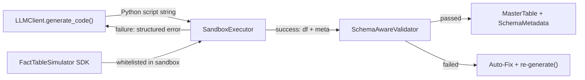

# Subtask 3: Sandbox Executor + Error Feedback Loop

## Problem

AGPDS Phase 2 requires the LLM to **write Python scripts** (not data) calling the [FactTableSimulator](file:///home/dingcheng/projects/chartAgent_copy/chartAgentVAGEN/pipeline/phase_2/fact_table_simulator.py#21-1035) SDK. These scripts must be:
1. **Executed safely** in a sandboxed environment
2. **Validated** against three-layer checks
3. **Retried with structured error feedback** when execution fails (max 3 attempts)

Currently, no sandbox executor exists. The existing [generate_with_validation()](file:///home/dingcheng/projects/chartAgent_copy/chartAgentVAGEN/pipeline/phase_2/validators.py#392-425) in [validators.py](file:///home/dingcheng/projects/chartAgent_copy/chartAgentVAGEN/pipeline/phase_2/validators.py) retries a `build_fn` with incremented seeds, but does not handle **LLM script execution, traceback capture, or LLM self-correction**. That function handles validation-level retries; the sandbox executor handles **execution-level retries** — a separate concern.

### Dependency Chain



---

## Proposed Changes

### Phase 2 Module

#### [NEW] [sandbox_executor.py](file:///home/dingcheng/projects/chartAgent_copy/chartAgentVAGEN/pipeline/phase_2/sandbox_executor.py)

The core new module. Key classes and functions:

**`SandboxExecutor`** — Executes LLM-generated Python scripts in a restricted `exec()` environment.

```python
class SandboxExecutor:
    """Execute LLM-generated FactTableSimulator scripts safely."""

    def execute(self, script: str, seed: int = 42) -> ExecutionResult:
        """
        Execute a Python script string in a sandboxed namespace.

        The namespace contains ONLY:
          - FactTableSimulator (the SDK)
          - Standard math/datetime (no os, sys, subprocess, etc.)

        Returns ExecutionResult with either (df, meta) or structured error.
        """
```

**`ExecutionResult`** — Typed result container:
```python
@dataclass
class ExecutionResult:
    success: bool
    df: Optional[pd.DataFrame] = None
    schema_metadata: Optional[dict] = None
    error_type: Optional[str] = None      # e.g., "ValueError", "SyntaxError"
    error_message: Optional[str] = None   # e.g., "Cannot achieve target_r=-0.8..."
    traceback_str: Optional[str] = None   # Full formatted traceback
    script: Optional[str] = None          # The script that was executed
```

**`format_error_feedback()`** — Formats execution errors for LLM self-correction:
```python
def format_error_feedback(result: ExecutionResult) -> str:
    """
    Format a failed ExecutionResult into structured feedback for the LLM.

    Returns a string like:
      "Your script raised ValueError on line 14:
       Cannot achieve target_r=-0.8 between wait_minutes (σ=12.3)
       and satisfaction (σ=1.1). Consider increasing variance or relaxing target.

       Full traceback:
       ..."
    """
```

**`run_with_retries()`** — Top-level orchestrator integrating LLM code generation, sandbox execution, and error feedback:
```python
def run_with_retries(
    llm_client: "LLMClient",
    scenario_context: str,
    system_prompt: str,
    max_retries: int = 3,
    seed: int = 42,
) -> ExecutionResult:
    """
    Full Phase 2 agentic loop:
    1. LLM generates Python script via generate_code()
    2. SandboxExecutor.execute() runs the script
    3. On SUCCESS → return result
    4. On FAILURE → format error feedback, append to conversation, retry
    5. After max_retries failures → return last error result
    """
```

**Sandbox security model:**
- Use `exec()` with a **restricted `__builtins__`** — only safe builtins (e.g., `range`, `len`, `abs`, `round`, [min](file:///home/dingcheng/projects/chartAgent_copy/chartAgentVAGEN/pipeline/core/llm_client.py#399-407), `max`, `int`, `float`, [str](file:///home/dingcheng/projects/chartAgent_copy/chartAgentVAGEN/pipeline/phase_2/validators.py#75-162), `list`, `dict`, `tuple`, [set](file:///home/dingcheng/projects/chartAgent_copy/chartAgentVAGEN/pipeline/phase_2/fact_table_simulator.py#446-480), `print`, `True`, `False`, `None`)
- Whitelisted imports: [FactTableSimulator](file:///home/dingcheng/projects/chartAgent_copy/chartAgentVAGEN/pipeline/phase_2/fact_table_simulator.py#21-1035), `numpy`, `pandas`, `datetime`, `math`
- **Blocked**: `os`, `sys`, `subprocess`, `importlib`, `__import__`, `open`, `eval`, `exec`, `compile`, `globals`, `locals`, file I/O
- **Timeout**: wrap execution in a signal-based timeout (30 seconds default)

> [!IMPORTANT]
> We use `exec()` with restricted globals rather than `subprocess` isolation. This is sufficient for our use case because:
> 1. The LLM is our own controlled agent (not arbitrary user input)
> 2. Scripts only call [FactTableSimulator](file:///home/dingcheng/projects/chartAgent_copy/chartAgentVAGEN/pipeline/phase_2/fact_table_simulator.py#21-1035) SDK methods
> 3. A blocked builtins approach prevents filesystem/network access
>
> If stronger isolation is needed later, this can be upgraded to `subprocess` + `seccomp` without changing the public API.

---

#### [MODIFY] [\_\_init\_\_.py](file:///home/dingcheng/projects/chartAgent_copy/chartAgentVAGEN/pipeline/phase_2/__init__.py)

Add exports for the new sandbox executor:
```diff
+from .sandbox_executor import SandboxExecutor, ExecutionResult, run_with_retries
 __all__ = [
      "FactTableSimulator",
+    "SandboxExecutor",
+    "ExecutionResult",
+    "run_with_retries",
      ...
 ]
```

---

#### [NEW] [tests/test_sandbox_executor.py](file:///home/dingcheng/projects/chartAgent_copy/chartAgentVAGEN/pipeline/phase_2/tests/test_sandbox_executor.py)

Test cases covering:

| # | Test | Description |
|---|------|-------------|
| 1 | Valid script execution | A correct `build_fact_table()` script produces [(df, meta)](file:///home/dingcheng/projects/chartAgent_copy/chartAgentVAGEN/pipeline/phase_2/validators.py#19-26) |
| 2 | SyntaxError capture | Malformed Python → `ExecutionResult(success=False, error_type="SyntaxError")` |
| 3 | SDK ValueError capture | Script with infeasible [target_r](file:///home/dingcheng/projects/chartAgent_copy/chartAgentVAGEN/pipeline/phase_2/validators.py#354-357) → structured ValueError feedback |
| 4 | Blocked imports | Script with `import os` → `ExecutionResult(success=False, error_type="ImportError")` |
| 5 | Blocked builtins | Script calling `open()` or `exec()` → blocked |
| 6 | Timeout enforcement | Infinite loop script → timeout error |
| 7 | Error feedback formatting | `format_error_feedback()` produces parseable, LLM-friendly text |
| 8 | Seed propagation | Same script + same seed → identical results |

---

## Verification Plan

### Automated Tests

Run the test suite from the pipeline directory:

```bash
cd /home/dingcheng/projects/chartAgent_copy/chartAgentVAGEN/pipeline
python -m phase_2.tests.test_sandbox_executor
```

This follows the same pattern as the existing [test_fact_table_simulator.py](file:///home/dingcheng/projects/chartAgent_copy/chartAgentVAGEN/pipeline/phase_2/tests/test_fact_table_simulator.py) which uses script-style `assert` + `print` tests.

### Integration Smoke Test

After implementation, verify the full chain works by running a mini integration test that:
1. Creates an [LLMClient](file:///home/dingcheng/projects/chartAgent_copy/chartAgentVAGEN/pipeline/core/llm_client.py#191-393) (mock or real if API key available)
2. Provides a known scenario context
3. Calls `run_with_retries()` end-to-end
4. Asserts a valid `DataFrame` + [SchemaMetadata](file:///home/dingcheng/projects/chartAgent_copy/chartAgentVAGEN/pipeline/phase_2/schema_metadata.py#69-84) is returned

### Manual Verification

Verify the sandbox actually blocks dangerous operations by attempting to run scripts that:
- `import os; os.system("echo pwned")`
- `open("/etc/passwd")`
- Infinite loop (verify timeout fires)

These are covered by automated tests 4, 5, and 6.
